# Implement TimeSeriesWeihai.pdf in python
## State-Space models and the Kalman filter
### generate State Space model


```python
import numpy as np

def StateSpaceGen(sigmae, sigmau, z, w, const, n):
    y = []
    alpha = []
    e = np.sqrt(sigmae) * np.random.randn(n)
    u = np.sqrt(sigmau) * np.random.randn(n)
    y.append(e[0])
    alpha.append(u[0])
    for i in range(1, n):
        y.append(z * alpha[i - 1] + e[i])
        alpha.append(const + w * alpha[i - 1] + u[i])
    return y, alpha
```


```python
np.random.seed(1233)
y, alpha = StateSpaceGen(0.5, 0.1, 1, 0.8, 0.3, 100)
```

### plot State Space model


```python
import matplotlib.pyplot as plt

plt.figure(figsize=(8, 6), dpi=600)
plt.plot(y)
plt.plot(alpha)
plt.xlabel('x', fontsize=14)
plt.ylabel('y', fontsize=14)
plt.legend(['y', 'alpha'], fontsize=14)
plt.grid()
plt.show()
```


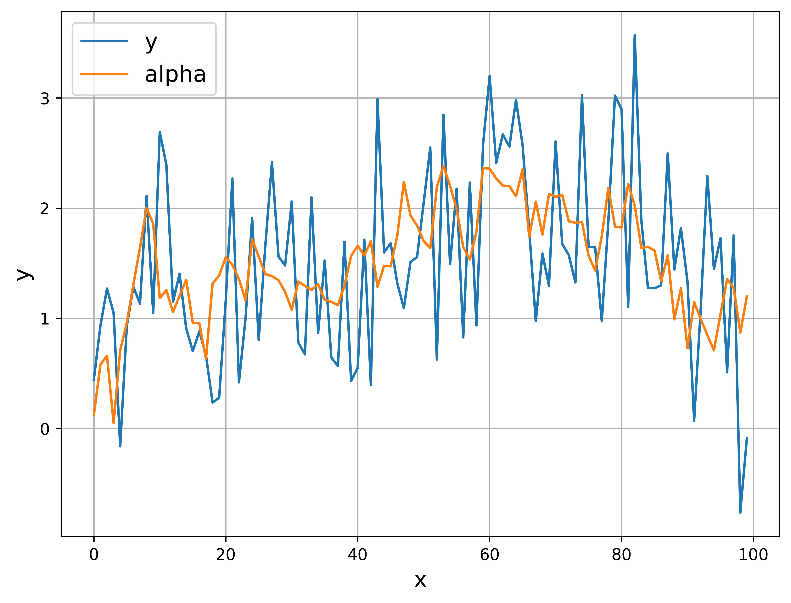


### kalman filter


```python
def KF(sigmae, sigmau, z, w, const, y):
    n = len(y)
    a = []
    p = []
    k = []
    v = []
    a.append(y[0])
    p.append(10000)
    k.append(0)
    v.append(0)
    if w < 1:
        a[0] = 0
        p[0] = sigmau / (1 - np.sqrt(w))
    for t in range(1, n):
        k.append((z * w * p[t - 1]) / (pow(z, 2) * p[t - 1] + sigmae))
        p.append(pow(w, 2) * p[t - 1] - w * z * k[t] * p[t - 1] + sigmau)
        v.append(y[t] - z * a[t - 1])
        a.append(const + w * a[t - 1] + k[t] * v[t])
    return a
```


```python
np.random.seed(314)
y, alpha = StateSpaceGen(0.5, 0.1, 1, 0.8, 0.3, 100)
a = KF(0.5, 0.1, 1, 0.8, 0.3, y)
```

### plot state space model with kalman filter


```python
import matplotlib.pyplot as plt

plt.figure(figsize=(8, 6), dpi=600)
plt.plot(y, label="y")
plt.plot(a, label="a")
plt.plot(alpha, label="alpha")
plt.legend(fontsize=14)
plt.grid()
plt.show()
```


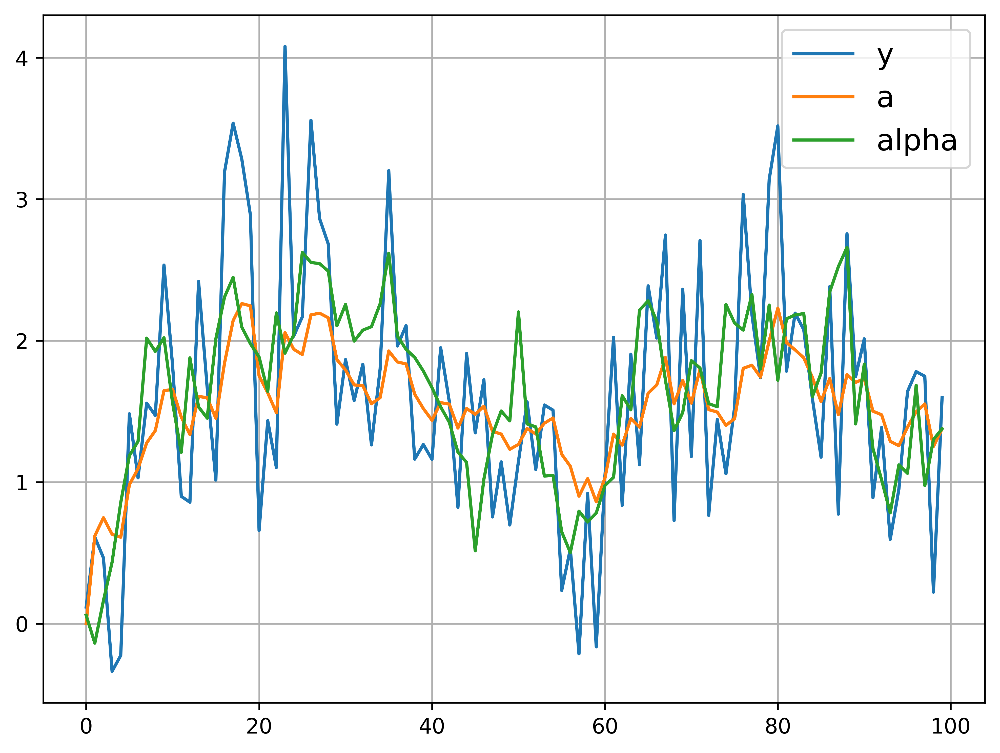


### estimate parameters


```python
def Log_Like_SS(params, y):
    sigmae = abs(params[0])
    sigmau = abs(params[1])
    w = abs(params[2])
    const = abs(params[3])
    z = 1
    n = len(y)
    a = [y[0]]
    p = [10000]
    k = [0]
    v = [0]
    likelihood = 0
    if w < 1:
        a[0] = 0
        p[0] = sigmau / (1 - np.sqrt(w))
    for t in range(1, n):
        k.append((z * w * p[t - 1]) / (pow(z, 2) * p[t - 1] + sigmae))
        p.append(pow(w, 2) * p[t - 1] - w * z * k[t] * p[t - 1] + sigmau)
        v.append(y[t] - z * a[t - 1])
        a.append(const + w * a[t - 1] + k[t] * v[t])
        likelihood += 0.5 * np.log(2 * np.pi) + 0.5 * np.log(pow(
            z, 2) * p[t - 1] + sigmae) + 0.5 * (pow(v[t], 2) / (pow(z, 2) * p[t - 1] + sigmae))
    return likelihood
```

#### LogLikeSS


```python
import pandas as pd
from scipy.optimize import minimize

np.random.seed(444)
y, alpha = StateSpaceGen(0.85, 0.5, 1, 0.3, 0.3, 12000)
sigmae = 0.85
sigmau = 0.5
w = 0.3
const = 0.3
params_Log_Like_SS = [sigmae, sigmau, w, const]
result_Log_Like_SS = minimize(fun = Log_Like_SS, x0 = params_Log_Like_SS, args = y, method = 'Nelder-Mead')
print(result_Log_Like_SS)

output_Estmate = pd.Series()
output_Estmate['sigmae'] = abs(result_Log_Like_SS.x[0])
output_Estmate['sigmau'] = abs(result_Log_Like_SS.x[1])
output_Estmate['w'] = abs(result_Log_Like_SS.x[2])
output_Estmate['const'] = abs(result_Log_Like_SS.x[3])

output_True = pd.Series()
output_True['sigmae'] = 0.85
output_True['sigmau'] = 0.5
output_True['w'] = 0.3
output_True['const'] = 0.3

output = pd.DataFrame()
output['Estimate Params'] = output_Estmate
output['Ture Params'] = output_True
output
```

     final_simplex: (array([[0.80016561, 0.57257628, 0.30344989, 0.28746792],
           [0.80024072, 0.57250253, 0.30347196, 0.28745619],
           [0.80021509, 0.57252066, 0.303474  , 0.28746118],
           [0.8002226 , 0.57252839, 0.30346759, 0.28746078],
           [0.80024514, 0.57249131, 0.3034842 , 0.28744822]]), array([19063.72060362, 19063.72060368, 19063.72060369, 19063.7206038 ,
           19063.7206038 ]))
               fun: 19063.720603622372
           message: 'Optimization terminated successfully.'
              nfev: 172
               nit: 98
            status: 0
           success: True
                 x: array([0.80016561, 0.57257628, 0.30344989, 0.28746792])
    

    c:\users\jx_g\appdata\local\programs\python\python36\lib\site-packages\ipykernel_launcher.py:14: DeprecationWarning: The default dtype for empty Series will be 'object' instead of 'float64' in a future version. Specify a dtype explicitly to silence this warning.
      
    c:\users\jx_g\appdata\local\programs\python\python36\lib\site-packages\ipykernel_launcher.py:20: DeprecationWarning: The default dtype for empty Series will be 'object' instead of 'float64' in a future version. Specify a dtype explicitly to silence this warning.
    


<div>
<style scoped>
    .dataframe tbody tr th:only-of-type {
        vertical-align: middle;
    }

    .dataframe tbody tr th {
        vertical-align: top;
    }

    .dataframe thead th {
        text-align: right;
    }
</style>
<table border="1" class="dataframe">
  <thead>
    <tr style="text-align: right;">
      <th></th>
      <th>Estimate Params</th>
      <th>Ture Params</th>
    </tr>
  </thead>
  <tbody>
    <tr>
      <th>sigmae</th>
      <td>0.800166</td>
      <td>0.85</td>
    </tr>
    <tr>
      <th>sigmau</th>
      <td>0.572576</td>
      <td>0.50</td>
    </tr>
    <tr>
      <th>w</th>
      <td>0.303450</td>
      <td>0.30</td>
    </tr>
    <tr>
      <th>const</th>
      <td>0.287468</td>
      <td>0.30</td>
    </tr>
  </tbody>
</table>
</div>


#### LogLikeSSconc


```python
def Log_Like_SSconc(params, y):
    q = abs(params[0])
    w = abs(params[1])
    const = abs(params[2])
    z = 1
    n = len(y)
    a = [y[0]]
    p = [10000]
    k = [0]
    v = [0]
    likelihood = 0
    sigmae = 0.000001
    for t in range(1, n):
        k.append((z * w * p[t - 1]) / (pow(z, 2) * p[t - 1] + 1))
        p.append(pow(w, 2) * p[t - 1] - w * z * k[t] * p[t - 1] + q)
        v.append(y[t] - z * a[t - 1])
        a.append(const + w * a[t - 1] + k[t] * v[t])
        sigmae += pow(v[t], 2) / (pow(z, 2) * p[t - 1] + 1)
        likelihood += 0.5 * np.log(2 * np.pi) + + \
            0.5 + 0.5 * np.log(pow(z, 2) * p[t - 1] + 1)
    likelihood += 0.5 * n * np.log(sigmae / n)
    return likelihood
```


```python
np.random.seed(123)
y, alpha = StateSpaceGen(0.5, 0.1, 1, 0.8, 0.3, 12000)
q = 0.04
w = 0.8
const = 0.3
params_Log_Like_SSconc = [q, w, const]
res_Log_Like_SSconc = minimize(fun = Log_Like_SSconc,x0 = params_Log_Like_SSconc, args = y, method = 'Nelder-Mead')
print(res_Log_Like_SSconc)

output_Estmate = pd.Series()
output_Estmate['q'] = abs(res_Log_Like_SSconc.x[0])
output_Estmate['w'] = abs(res_Log_Like_SSconc.x[1])
output_Estmate['const'] = abs(res_Log_Like_SSconc.x[2])

output_True = pd.Series()
output_True['q'] = 0.2
output_True['w'] = 0.8
output_True['const'] = 0.3

output = pd.DataFrame()
output['Estimate Params'] = output_Estmate
output['Ture Params'] = output_True
output
```

     final_simplex: (array([[0.20679793, 0.80592369, 0.29292901],
           [0.20676188, 0.80595735, 0.2928744 ],
           [0.20680778, 0.80591211, 0.29293995],
           [0.20687372, 0.80591782, 0.29294389]]), array([14714.11847736, 14714.11848092, 14714.11848117, 14714.11848274]))
               fun: 14714.118477360456
           message: 'Optimization terminated successfully.'
              nfev: 140
               nit: 77
            status: 0
           success: True
                 x: array([0.20679793, 0.80592369, 0.29292901])
    

    c:\users\jx_g\appdata\local\programs\python\python36\lib\site-packages\ipykernel_launcher.py:10: DeprecationWarning: The default dtype for empty Series will be 'object' instead of 'float64' in a future version. Specify a dtype explicitly to silence this warning.
      # Remove the CWD from sys.path while we load stuff.
    c:\users\jx_g\appdata\local\programs\python\python36\lib\site-packages\ipykernel_launcher.py:15: DeprecationWarning: The default dtype for empty Series will be 'object' instead of 'float64' in a future version. Specify a dtype explicitly to silence this warning.
      from ipykernel import kernelapp as app
    


<div>
<style scoped>
    .dataframe tbody tr th:only-of-type {
        vertical-align: middle;
    }

    .dataframe tbody tr th {
        vertical-align: top;
    }

    .dataframe thead th {
        text-align: right;
    }
</style>
<table border="1" class="dataframe">
  <thead>
    <tr style="text-align: right;">
      <th></th>
      <th>Estimate Params</th>
      <th>Ture Params</th>
    </tr>
  </thead>
  <tbody>
    <tr>
      <th>q</th>
      <td>0.206798</td>
      <td>0.2</td>
    </tr>
    <tr>
      <th>w</th>
      <td>0.805924</td>
      <td>0.8</td>
    </tr>
    <tr>
      <th>const</th>
      <td>0.292929</td>
      <td>0.3</td>
    </tr>
  </tbody>
</table>
</div>


## The Local level model (or simple exponential smoothing)
### generate the model


```python
import numpy as np
np.random.seed(153)
y, alpha = StateSpaceGen(0.5, 0.2, 1, 1, 0, 100)
```

### plot the model


```python
import matplotlib.pyplot as plt

plt.figure(figsize=(8, 6), dpi=600)
plt.plot(y, label="y")
plt.plot(alpha, label="alpha")
plt.legend(fontsize=14)
plt.grid()
plt.show()
```


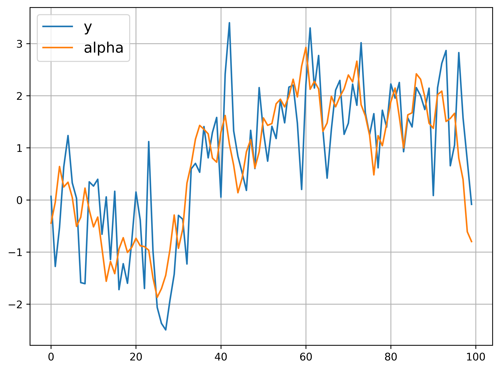


### estimate parameter
#### LikeExpSmooth


```python
def Like_Exp_Smooth(params, y):
    sigmae = abs(params[0])
    sigmau = abs(params[1])
    w = 1
    const = 0
    z = 1
    n = len(y)
    a = [y[0]]
    p = [10000]
    k = [0]
    v = [0]
    likelihood = 0
    for t in range(1, n):
        k.append((z * w * p[t - 1]) / (pow(z, 2) * p[t - 1] + sigmae))
        p.append(pow(w, 2) * p[t - 1] - w * z * k[t] * p[t - 1] + sigmau)
        v.append(y[t] - z * a[t - 1])
        a.append(const + w * a[t - 1] + k[t] * v[t])
        likelihood += 0.5 * np.log(2 * np.pi) + 0.5 * np.log(pow(
            z, 2) * p[t - 1] + sigmae) + 0.5 * (pow(v[t], 2) / (pow(z, 2) * p[t - 1] + sigmae))
    return likelihood
```


```python
np.random.seed(153)
y, alpha = StateSpaceGen(0.5, 0.2, 1, 1, 0, 10000)
sigmae = 0.5
sigmau = 0.2
params = [sigmae, sigmau]
res_Like_Exp_Smooth = minimize(Like_Exp_Smooth, params, y, method='Nelder-Mead')
print(res_Like_Exp_Smooth)

output_Estmate = pd.Series()
output_Estmate['sigmae'] = abs(res_Like_Exp_Smooth.x[0])
output_Estmate['sigmau'] = abs(res_Like_Exp_Smooth.x[1])

output_True = pd.Series()
output_True['sigmae'] = 0.5
output_True['sigmau'] = 0.2

output = pd.DataFrame()
output['Estimate Params'] = output_Estmate
output['Ture Params'] = output_True
output
```

     final_simplex: (array([[0.50041998, 0.1887327 ],
           [0.5004802 , 0.18871827],
           [0.50036464, 0.18880931]]), array([13755.27301061, 13755.27302624, 13755.27303278]))
               fun: 13755.273010608671
           message: 'Optimization terminated successfully.'
              nfev: 40
               nit: 20
            status: 0
           success: True
                 x: array([0.50041998, 0.1887327 ])
    

    c:\users\jx_g\appdata\local\programs\python\python36\lib\site-packages\ipykernel_launcher.py:9: DeprecationWarning: The default dtype for empty Series will be 'object' instead of 'float64' in a future version. Specify a dtype explicitly to silence this warning.
      if __name__ == '__main__':
    c:\users\jx_g\appdata\local\programs\python\python36\lib\site-packages\ipykernel_launcher.py:13: DeprecationWarning: The default dtype for empty Series will be 'object' instead of 'float64' in a future version. Specify a dtype explicitly to silence this warning.
      del sys.path[0]
    


<div>
<style scoped>
    .dataframe tbody tr th:only-of-type {
        vertical-align: middle;
    }

    .dataframe tbody tr th {
        vertical-align: top;
    }

    .dataframe thead th {
        text-align: right;
    }
</style>
<table border="1" class="dataframe">
  <thead>
    <tr style="text-align: right;">
      <th></th>
      <th>Estimate Params</th>
      <th>Ture Params</th>
    </tr>
  </thead>
  <tbody>
    <tr>
      <th>sigmae</th>
      <td>0.500420</td>
      <td>0.5</td>
    </tr>
    <tr>
      <th>sigmau</th>
      <td>0.188733</td>
      <td>0.2</td>
    </tr>
  </tbody>
</table>
</div>


#### LikeExpSmoothConc


```python
def Like_Exp_Smooth_Conc(params,y):
    q = abs(params[0])
    w = 1
    const = 0
    z = 1
    n = len(y)
    a = [y[0]]
    p = [10000]
    k = [0]
    v = [0]
    likelihood = 0
    sigmae = 0.000001
    for t in range(1,n):
        k.append((z*w*p[t-1])/(pow(z,2)*p[t-1]+1))
        p.append(pow(w,2)*p[t-1]-w*z*k[t]*p[t-1]+q)
        v.append(y[t]-z*a[t-1])
        a.append(const+w*a[t-1]+k[t]*v[t])
        sigmae+=pow(v[t],2)/(pow(z,2)*p[t-1]+1)
        likelihood +=0.5*np.log(2*np.pi)+0.5+0.5*np.log(pow(z,2)*p[t-1]+1)
    likelihood +=0.5*n*np.log(sigmae/n)
    return likelihood
```


```python
np.random.seed(153)
y, alpha = StateSpaceGen(0.5, 0.2, 1, 1, 0, 10000)
q = 0.4
res_Like_Exp_Smooth_Conc = minimize(Like_Exp_Smooth_Conc, q, y, method = 'Nelder-Mead')
print(res_Like_Exp_Smooth_Conc)

output_Estmate = pd.Series()
output_Estmate['q'] = abs(res_Like_Exp_Smooth_Conc.x[0])

output_True = pd.Series()
output_True['q'] = 0.4

output = pd.DataFrame()
output['Estimate Param'] = output_Estmate
output['Ture Param'] = output_True
output
```

     final_simplex: (array([[0.3775    ],
           [0.37742188]]), array([13754.08049069, 13754.08049818]))
               fun: 13754.080490694107
           message: 'Optimization terminated successfully.'
              nfev: 20
               nit: 10
            status: 0
           success: True
                 x: array([0.3775])
    

    c:\users\jx_g\appdata\local\programs\python\python36\lib\site-packages\ipykernel_launcher.py:7: DeprecationWarning: The default dtype for empty Series will be 'object' instead of 'float64' in a future version. Specify a dtype explicitly to silence this warning.
      import sys
    c:\users\jx_g\appdata\local\programs\python\python36\lib\site-packages\ipykernel_launcher.py:10: DeprecationWarning: The default dtype for empty Series will be 'object' instead of 'float64' in a future version. Specify a dtype explicitly to silence this warning.
      # Remove the CWD from sys.path while we load stuff.
    


<div>
<style scoped>
    .dataframe tbody tr th:only-of-type {
        vertical-align: middle;
    }

    .dataframe tbody tr th {
        vertical-align: top;
    }

    .dataframe thead th {
        text-align: right;
    }
</style>
<table border="1" class="dataframe">
  <thead>
    <tr style="text-align: right;">
      <th></th>
      <th>Estimate Param</th>
      <th>Ture Param</th>
    </tr>
  </thead>
  <tbody>
    <tr>
      <th>q</th>
      <td>0.3775</td>
      <td>0.4</td>
    </tr>
  </tbody>
</table>
</div>


## Exercise: (Auto)regression with time varying parameter


```python
import numpy as np

np.random.seed(234)
n = 100
e = np.sqrt(0.5) * np.random.randn(n)
u = np.sqrt(0.02) * np.random.randn(n)
y = [e[0]]
alpha = [u[0] + 0.75]
for t in range(1, n):
    z = y[t - 1]
    y.append(z * alpha[t - 1] + e[t])
    alpha.append(alpha[t - 1] + u[t])
```


```python
import matplotlib.pyplot as plt

plt.figure(figsize=(8, 6), dpi=600)
plt.plot(y, label="y")
plt.plot(alpha, label="alpha")
plt.legend(fontsize=14)
plt.grid()
plt.show()
```


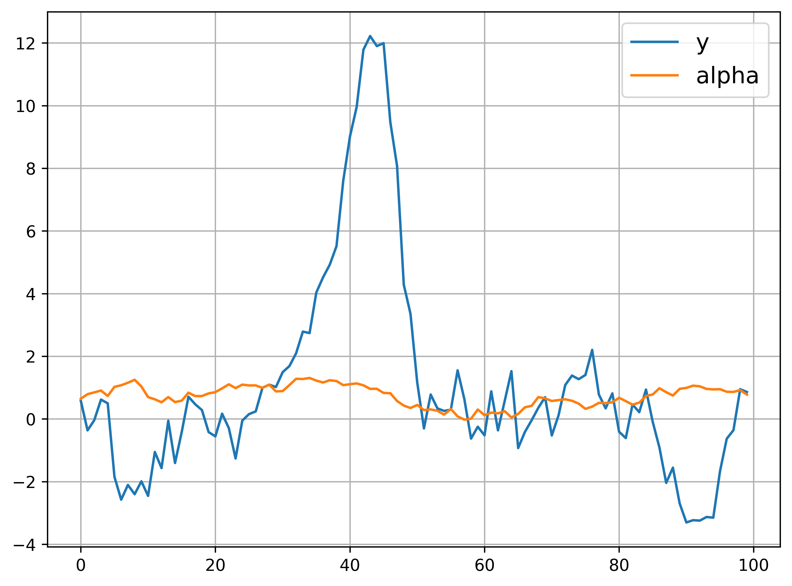


### estimate params


```python
def Like_AR1_TV(params, y):
    w = 1
    k = [0]
    v = [0]
    const = 0
    n = len(y)
    a = [y[0]]
    p = [10000]
    likelihood = 0
    sigmae = abs(params[0])
    sigmau = abs(params[1])
    for t in range(1, n):
        z = y[t - 1]
        k.append((z * w * p[t - 1]) / (pow(z, 2) * p[t - 1] + sigmae))
        p.append(pow(w, 2) * p[t - 1] - w * z * k[t] * p[t - 1] + sigmau)
        v.append(y[t] - z * a[t - 1])
        a.append(const + w * a[t - 1] + k[t] * v[t])
        likelihood += 0.5 * np.log(2 * np.pi) + 0.5 * np.log(pow(
            z, 2) * p[t - 1] + sigmae) + 0.5 * (pow(v[t], 2) / (pow(z, 2) * p[t - 1] + sigmae))
    return likelihood
```


```python
import numpy as np

np.random.seed(234)
n = 500
e = np.sqrt(0.5) * np.random.randn(n)
u = np.sqrt(0.02) * np.random.randn(n)
y = [e[0]]
alpha = [0.65 + u[0]]
for t in range(1, n):
    z = y[t - 1]
    y.append(z * alpha[t - 1] + e[t])
    alpha.append(alpha[t - 1] + u[t])
```


```python
import pandas as pd
from scipy.optimize import minimize

sigmae = 0.5
sigmau = 0.02
params = [sigmae,sigmau]
res_Like_AR1_TV = minimize(Like_AR1_TV, x0 = params,args = y, method='Nelder-Mead')
print(res_Like_AR1_TV)

output_Estmate = pd.Series()
output_Estmate['sigmae'] = abs(res_Like_AR1_TV.x[0])
output_Estmate['sigmau'] = abs(res_Like_AR1_TV.x[1])

output_True = pd.Series()
output_True['sigmae'] = 0.5
output_True['sigmau'] = 0.02

output = pd.DataFrame()
output['Estimate Param'] = output_Estmate
output['Ture Param'] = output_True
output
```

     final_simplex: (array([[0.50192621, 0.0218504 ],
           [0.50185433, 0.02185231],
           [0.5018768 , 0.02185702]]), array([2693.64893925, 2693.64893951, 2693.6489408 ]))
               fun: 2693.6489392485164
           message: 'Optimization terminated successfully.'
              nfev: 40
               nit: 21
            status: 0
           success: True
                 x: array([0.50192621, 0.0218504 ])
    

    c:\users\jx_g\appdata\local\programs\python\python36\lib\site-packages\ipykernel_launcher.py:10: DeprecationWarning: The default dtype for empty Series will be 'object' instead of 'float64' in a future version. Specify a dtype explicitly to silence this warning.
      # Remove the CWD from sys.path while we load stuff.
    c:\users\jx_g\appdata\local\programs\python\python36\lib\site-packages\ipykernel_launcher.py:14: DeprecationWarning: The default dtype for empty Series will be 'object' instead of 'float64' in a future version. Specify a dtype explicitly to silence this warning.
      
    


<div>
<style scoped>
    .dataframe tbody tr th:only-of-type {
        vertical-align: middle;
    }

    .dataframe tbody tr th {
        vertical-align: top;
    }

    .dataframe thead th {
        text-align: right;
    }
</style>
<table border="1" class="dataframe">
  <thead>
    <tr style="text-align: right;">
      <th></th>
      <th>Estimate Param</th>
      <th>Ture Param</th>
    </tr>
  </thead>
  <tbody>
    <tr>
      <th>sigmae</th>
      <td>0.501926</td>
      <td>0.50</td>
    </tr>
    <tr>
      <th>sigmau</th>
      <td>0.021850</td>
      <td>0.02</td>
    </tr>
  </tbody>
</table>
</div>


```python
def Like_AR1_TV_Conc(params, y):
    w = 1
    k = [0]
    v = [0]
    const = 0
    p = [10000]
    n = len(y)
    a = [y[0]]
    likelihood = 0
    sigmae = 0.000001
    q = abs(params[0])
    for t in range(1, n):
        z = y[t - 1]
        k.append((z * w * p[t - 1]) / (pow(z, 2) * p[t - 1] + 1))
        p.append(pow(w, 2) * p[t - 1] - w * z * k[t] * p[t - 1] + q)
        v.append(y[t] - z * a[t - 1])
        a.append(const + w * a[t - 1] + k[t] * v[t])
        sigmae += pow(v[t], 2) / (pow(z, 2) * p[t - 1] + 1)
        likelihood += 0.5 * np.log(2 * np.pi) + 0.5 + \
            0.5 * np.log(pow(z, 2) * p[t - 1] + 1)
    likelihood += 0.5 * n * np.log(sigmae / n)
    return likelihood
```


```python
q = 0.04
param = q
res_Like_AR1_TV_Conc = minimize(Like_AR1_TV_Conc, param, y, method='Nelder-Mead')
print(res_Like_AR1_TV_Conc)

output_Estmate = pd.Series()
output_Estmate['q'] = abs(res_Like_AR1_TV_Conc.x[0])

output_True = pd.Series()
output_True['q'] = 0.04

output = pd.DataFrame()
output['Estimate Param'] = output_Estmate
output['Ture Param'] = output_True
output
```

     final_simplex: (array([[0.043875 ],
           [0.0438125]]), array([2692.45647909, 2692.45650101]))
               fun: 2692.456479094329
           message: 'Optimization terminated successfully.'
              nfev: 14
               nit: 7
            status: 0
           success: True
                 x: array([0.043875])
    

    c:\users\jx_g\appdata\local\programs\python\python36\lib\site-packages\ipykernel_launcher.py:6: DeprecationWarning: The default dtype for empty Series will be 'object' instead of 'float64' in a future version. Specify a dtype explicitly to silence this warning.
      
    c:\users\jx_g\appdata\local\programs\python\python36\lib\site-packages\ipykernel_launcher.py:9: DeprecationWarning: The default dtype for empty Series will be 'object' instead of 'float64' in a future version. Specify a dtype explicitly to silence this warning.
      if __name__ == '__main__':
    


<div>
<style scoped>
    .dataframe tbody tr th:only-of-type {
        vertical-align: middle;
    }

    .dataframe tbody tr th {
        vertical-align: top;
    }

    .dataframe thead th {
        text-align: right;
    }
</style>
<table border="1" class="dataframe">
  <thead>
    <tr style="text-align: right;">
      <th></th>
      <th>Estimate Param</th>
      <th>Ture Param</th>
    </tr>
  </thead>
  <tbody>
    <tr>
      <th>q</th>
      <td>0.043875</td>
      <td>0.04</td>
    </tr>
  </tbody>
</table>
</div>


## The Local Level with drift: (the Theta method)
### generate the series


```python
import numpy as np

def StateSpaceGen(sigmae, sigmau, z, w, const, n):
    y = []
    alpha = []
    e = np.sqrt(sigmae) * np.random.randn(n)
    u = np.sqrt(sigmau) * np.random.randn(n)
    y.append(e[0])
    alpha.append(u[0])
    for i in range(1, n):
        y.append(z * alpha[i - 1] + e[i])
        alpha.append(const + w * alpha[i - 1] + u[i])
    return y, alpha

np.random.seed(572)
sigmae = 0.8
sigmau = 0.1
z = 1
w = 1
const = 0.1
n = 100
y,alpha = StateSpaceGen(sigmae, sigmau, z, w, const, n)
```

### plot series


```python
import matplotlib.pyplot as plt

plt.figure(figsize=(8, 6), dpi=600)
plt.plot(y, label="y")
plt.plot(alpha, label="alpha")
plt.legend(fontsize=14)
plt.grid()
plt.show()
```


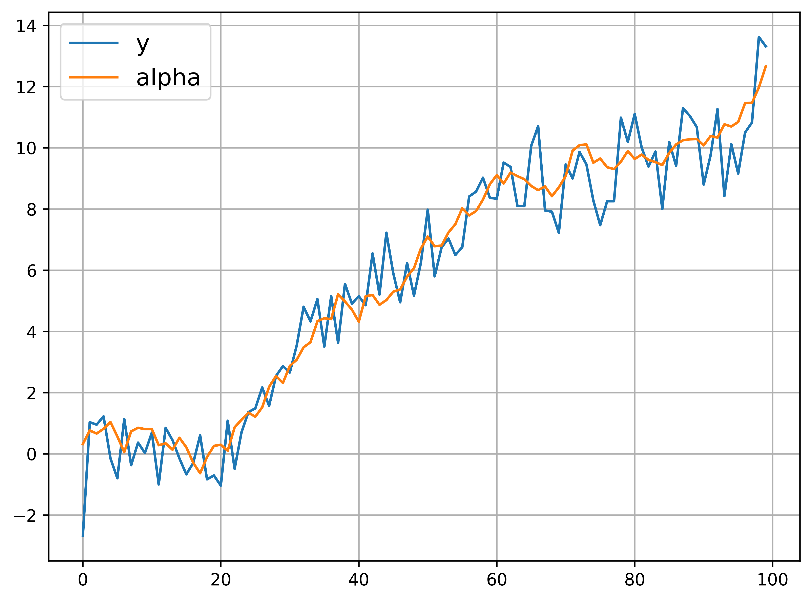


### estimate parameters
#### LikeTheta


```python
def Like_Theta(params, y):
    sigmae = abs(params[0])
    sigmau = abs(params[1])
    const = abs(params[2])
    w = 1
    z = 1
    k = [0]
    v = [0]
    n = len(y)
    a = [y[0]]
    p = [10000]
    likelihood = 0
    for t in range(1, n):
        k.append((z * w * p[t - 1]) / (pow(z, 2) * p[t - 1] + sigmae))
        p.append(pow(w, 2) * p[t - 1] - w * z * k[t] * p[t - 1] + sigmau)
        v.append(y[t] - z * a[t - 1])
        a.append(const + w * a[t - 1] + k[t] * v[t])
        likelihood += 0.5 * np.log(2 * np.pi) + 0.5 * np.log(pow(
            z, 2) * p[t - 1] + sigmae) + 0.5 * (pow(v[t], 2) / (pow(z, 2) * p[t - 1] + sigmae))
    return likelihood
```


```python
import pandas as pd
from scipy.optimize import minimize

np.random.seed(572)
y,alpha = StateSpaceGen(0.8, 0.1, 1, 1, 0.1, 10000)
sigmae = 0.8
sigmau = 0.1
const = 0.1
params = [sigmae, sigmau, const]
res_Like_Theta = minimize(Like_Theta, params, y)
print(res_Like_Theta)

output_Estmate = pd.Series()
output_Estmate['sigmae'] = abs(res_Like_Theta.x[0])
output_Estmate['sigmau'] = abs(res_Like_Theta.x[1])
output_Estmate['const'] = abs(res_Like_Theta.x[2])

output_True = pd.Series()
output_True['sigmae'] = 0.8
output_True['sigmau'] = 0.1
output_True['const'] = 0.1

output = pd.DataFrame()
output['Estimate Param'] = output_Estmate
output['Ture Param'] = output_True
output
```

          fun: 14797.558118956182
     hess_inv: array([[ 6.83021341e-06, -7.31435484e-06, -5.36472532e-06],
           [-7.31435484e-06,  7.84094189e-06,  5.74905314e-06],
           [-5.36472532e-06,  5.74905314e-06,  4.21570583e-06]])
          jac: array([0.0057373 , 0.00292969, 0.0032959 ])
      message: 'Desired error not necessarily achieved due to precision loss.'
         nfev: 200
          nit: 13
         njev: 50
       status: 2
      success: False
            x: array([0.78849465, 0.10253551, 0.10980417])
    

    c:\users\jx_g\appdata\local\programs\python\python36\lib\site-packages\ipykernel_launcher.py:13: DeprecationWarning: The default dtype for empty Series will be 'object' instead of 'float64' in a future version. Specify a dtype explicitly to silence this warning.
      del sys.path[0]
    c:\users\jx_g\appdata\local\programs\python\python36\lib\site-packages\ipykernel_launcher.py:18: DeprecationWarning: The default dtype for empty Series will be 'object' instead of 'float64' in a future version. Specify a dtype explicitly to silence this warning.
    


<div>
<style scoped>
    .dataframe tbody tr th:only-of-type {
        vertical-align: middle;
    }

    .dataframe tbody tr th {
        vertical-align: top;
    }

    .dataframe thead th {
        text-align: right;
    }
</style>
<table border="1" class="dataframe">
  <thead>
    <tr style="text-align: right;">
      <th></th>
      <th>Estimate Param</th>
      <th>Ture Param</th>
    </tr>
  </thead>
  <tbody>
    <tr>
      <th>sigmae</th>
      <td>0.788495</td>
      <td>0.8</td>
    </tr>
    <tr>
      <th>sigmau</th>
      <td>0.102536</td>
      <td>0.1</td>
    </tr>
    <tr>
      <th>const</th>
      <td>0.109804</td>
      <td>0.1</td>
    </tr>
  </tbody>
</table>
</div>


#### LikeThetaConc


```python
def Like_Theta_Conc(params, y):
    q = abs(params[0])
    const = abs(params[1])
    w = 1
    z = 1
    n = len(y)
    a = [y[0]]
    p = [10000]
    k = [0]
    v = [0]
    likelihood = 0
    sigmae = 0
    for t in range(1, n):
        k.append((z * w * p[t - 1]) / (pow(z, 2) * p[t - 1] + 1))
        p.append(pow(w, 2) * p[t - 1] - w * z * k[t] * p[t - 1] + q)
        v.append(y[t] - z * a[t - 1])
        a.append(const + w * a[t - 1] + k[t] * v[t])
        sigmae += pow(v[t], 2) / (pow(z, 2) * p[t - 1] + 1)
        likelihood += 0.5 * np.log(2 * np.pi) + 0.5 + \
            0.5 * np.log(abs(z * z * p[t - 1] + 1))
    likelihood += 0.5 * n * np.log(sigmae / n)
    return likelihood
```


```python
np.random.seed(572)
y,alpha = StateSpaceGen(0.8, 0.1, 1, 1, 0.1, 10000)
q = 1/64
const = 0.1
params = [q,const]
res_Like_Theta_Conc = minimize(Like_Theta_Conc, params, y, method = 'Nelder-Mead')
print(res_Like_Theta_Conc)

output_Estmate = pd.Series()
output_Estmate['q'] = abs(res_Like_Theta_Conc.x[0])
output_Estmate['const'] = abs(res_Like_Theta_Conc.x[1])

output_True = pd.Series()
output_True['q'] = 1/64
output_True['const'] = 0.1

output = pd.DataFrame()
output['Estimate Param'] = output_Estmate
output['Ture Param'] = output_True
output
```

     final_simplex: (array([[0.13012068, 0.10981206],
           [0.13018308, 0.10980043],
           [0.13014979, 0.10977607]]), array([14796.82041949, 14796.82045237, 14796.82046294]))
               fun: 14796.820419486041
           message: 'Optimization terminated successfully.'
              nfev: 66
               nit: 34
            status: 0
           success: True
                 x: array([0.13012068, 0.10981206])
    

    c:\users\jx_g\appdata\local\programs\python\python36\lib\site-packages\ipykernel_launcher.py:9: DeprecationWarning: The default dtype for empty Series will be 'object' instead of 'float64' in a future version. Specify a dtype explicitly to silence this warning.
      if __name__ == '__main__':
    c:\users\jx_g\appdata\local\programs\python\python36\lib\site-packages\ipykernel_launcher.py:13: DeprecationWarning: The default dtype for empty Series will be 'object' instead of 'float64' in a future version. Specify a dtype explicitly to silence this warning.
      del sys.path[0]
    


<div>
<style scoped>
    .dataframe tbody tr th:only-of-type {
        vertical-align: middle;
    }

    .dataframe tbody tr th {
        vertical-align: top;
    }

    .dataframe thead th {
        text-align: right;
    }
</style>
<table border="1" class="dataframe">
  <thead>
    <tr style="text-align: right;">
      <th></th>
      <th>Estimate Param</th>
      <th>Ture Param</th>
    </tr>
  </thead>
  <tbody>
    <tr>
      <th>q</th>
      <td>0.130121</td>
      <td>0.015625</td>
    </tr>
    <tr>
      <th>const</th>
      <td>0.109812</td>
      <td>0.100000</td>
    </tr>
  </tbody>
</table>
</div>


# Single Source of Error approach
## The exponential smoothing with one source of error

### generate series


```python
import numpy as np

np.random.seed(213)
n = 100
sigmae = np.sqrt(0.6) * np.random.randn(n)
gamma = 0.3
y = [sigmae[0]]
alpha = [sigmae[0]]
for t in range(1, n):
    y.append(alpha[t-1] + sigmae[t])
    alpha.append(alpha[t-1] + gamma * sigmae[t])
```

### plot series


```python
import matplotlib.pyplot as plt

plt.figure(figsize=(8, 6), dpi=600)
plt.plot(y, label="y")
plt.plot(alpha, label="alpha")
plt.legend(fontsize=14)
plt.grid()
plt.show()
```


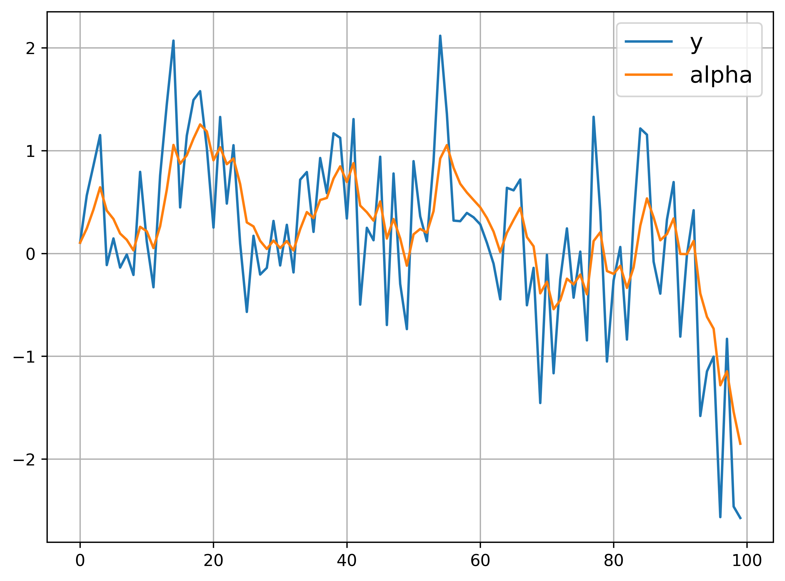


### estimate parameters


```python
def Exp_Smooth_Single(params,y):
    gamma = abs(params[0])
    n = len(y)
    z = 1
    e = [0]
    a = [y[0]]
    result = 0
    for t in range(1, n):
        e.append(y[t] - z * a[t - 1])
        a.append(a[t - 1] + gamma * e[t])
        result += e[t] * e[t]
    return result / n
```


```python
import pandas as pd
from scipy.optimize import minimize

gamma = 0.3
params = gamma
res_Exp_Smooth_Single = minimize(Exp_Smooth_Single, gamma, y, method = 'Nelder-Mead')
print(res_Exp_Smooth_Single)

output_Estmate = pd.Series()
output_Estmate['gamma'] = abs(res_Exp_Smooth_Single.x[0])

output_True = pd.Series()
output_True['gamma'] = 0.3

output = pd.DataFrame()
output['Estimate Param'] = output_Estmate
output['Ture Param'] = output_True
output
```

     final_simplex: (array([[0.36216797],
           [0.36222656]]), array([0.53149779, 0.5314978 ]))
               fun: 0.5314977949761004
           message: 'Optimization terminated successfully.'
              nfev: 24
               nit: 12
            status: 0
           success: True
                 x: array([0.36216797])
    

    c:\users\jx_g\appdata\local\programs\python\python36\lib\site-packages\ipykernel_launcher.py:9: DeprecationWarning: The default dtype for empty Series will be 'object' instead of 'float64' in a future version. Specify a dtype explicitly to silence this warning.
      if __name__ == '__main__':
    c:\users\jx_g\appdata\local\programs\python\python36\lib\site-packages\ipykernel_launcher.py:12: DeprecationWarning: The default dtype for empty Series will be 'object' instead of 'float64' in a future version. Specify a dtype explicitly to silence this warning.
      if sys.path[0] == '':
    


<div>
<style scoped>
    .dataframe tbody tr th:only-of-type {
        vertical-align: middle;
    }

    .dataframe tbody tr th {
        vertical-align: top;
    }

    .dataframe thead th {
        text-align: right;
    }
</style>
<table border="1" class="dataframe">
  <thead>
    <tr style="text-align: right;">
      <th></th>
      <th>Estimate Param</th>
      <th>Ture Param</th>
    </tr>
  </thead>
  <tbody>
    <tr>
      <th>gamma</th>
      <td>0.362168</td>
      <td>0.3</td>
    </tr>
  </tbody>
</table>
</div>


## The Theta method with one source of error
### generate the model


```python
import numpy as np

np.random.seed(5)
n = 100
sigmae = np.sqrt(0.5)*np.random.randn(n)
gamma = 0.1
const = 0.05
y = [sigmae[0]]
alpha = [sigmae[0]]
for t in range(1, n):
    y.append(alpha[t - 1] + sigmae[t])
    alpha.append(const + alpha[t - 1] + gamma * sigmae[t])
```

### plot the model


```python
import matplotlib.pyplot as plt

plt.figure(figsize=(8, 6), dpi=600)
plt.plot(y, label="y")
plt.plot(alpha, label="alpha")
plt.legend(fontsize=14)
plt.grid()
plt.show()
```


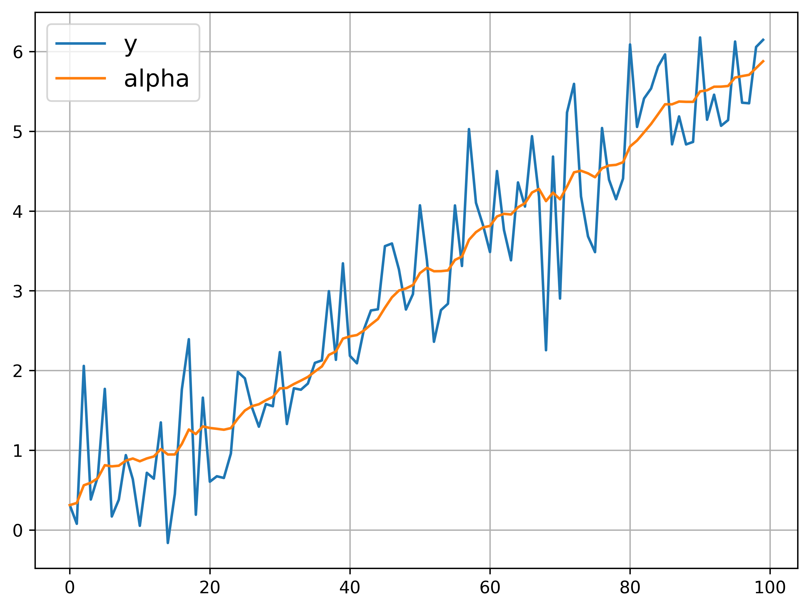


### estimate parameter


```python
def Theta_Single_source_error(params,y):
    n = len(y)
    z = 1
    e = [0]
    a = [y[0]]
    result = 0
    gamma = abs(params[0])
    for t in range(1,n):
        e.append(y[t]-z*a[t-1])
        a.append(a[t-1]+gamma*e[t])
        result+=(y[t]-z*a[t-1])**2
    return result/n
gamma = np.array([0.5])
```


```python
import pandas as pd
from scipy.optimize import minimize

gamma = 0.3
param = gamma
res_Theta_Single_source_error = minimize(Theta_Single_source_error, param, y, method = 'Nelder-Mead')
print(res_Theta_Single_source_error)

output_Estmate = pd.Series()
output_Estmate['gamma'] = abs(res_Theta_Single_source_error.x[0])

output_True = pd.Series()
output_True['gamma'] = 0.3

output = pd.DataFrame()
output['Estimate Param'] = output_Estmate
output['Ture Param'] = output_True
output
```

     final_simplex: (array([[0.27082031],
           [0.27076172]]), array([0.51467015, 0.51467015]))
               fun: 0.5146701487177444
           message: 'Optimization terminated successfully.'
              nfev: 22
               nit: 11
            status: 0
           success: True
                 x: array([0.27082031])
    

    c:\users\jx_g\appdata\local\programs\python\python36\lib\site-packages\ipykernel_launcher.py:9: DeprecationWarning: The default dtype for empty Series will be 'object' instead of 'float64' in a future version. Specify a dtype explicitly to silence this warning.
      if __name__ == '__main__':
    c:\users\jx_g\appdata\local\programs\python\python36\lib\site-packages\ipykernel_launcher.py:12: DeprecationWarning: The default dtype for empty Series will be 'object' instead of 'float64' in a future version. Specify a dtype explicitly to silence this warning.
      if sys.path[0] == '':
    


<div>
<style scoped>
    .dataframe tbody tr th:only-of-type {
        vertical-align: middle;
    }

    .dataframe tbody tr th {
        vertical-align: top;
    }

    .dataframe thead th {
        text-align: right;
    }
</style>
<table border="1" class="dataframe">
  <thead>
    <tr style="text-align: right;">
      <th></th>
      <th>Estimate Param</th>
      <th>Ture Param</th>
    </tr>
  </thead>
  <tbody>
    <tr>
      <th>gamma</th>
      <td>0.27082</td>
      <td>0.3</td>
    </tr>
  </tbody>
</table>
</div>


## Damped trend model with one source of error


```python
import numpy as np

np.random.seed(66)
n = 100
sigmae = np.sqrt(0.5) * np.random.randn(n)
gamma = 0.6
theta = 0.2
phi = 0.93
y = [sigmae[0]]
alpha = [sigmae[0]]
beta = [0]
for t in range(1, n):
    beta.append(phi * beta[t - 1] + theta * sigmae[t])
    alpha.append(alpha[t - 1] + phi * beta[t - 1] + gamma * sigmae[t])
    y.append(alpha[t - 1] + phi * beta[t - 1] + sigmae[t])
```

### plot the model


```python
import matplotlib.pyplot as plt

plt.figure(figsize=(8, 6), dpi=600)
plt.plot(y, label="y")
plt.plot(alpha, label="alpha")
plt.legend(fontsize=14)
plt.grid()
plt.show()
```


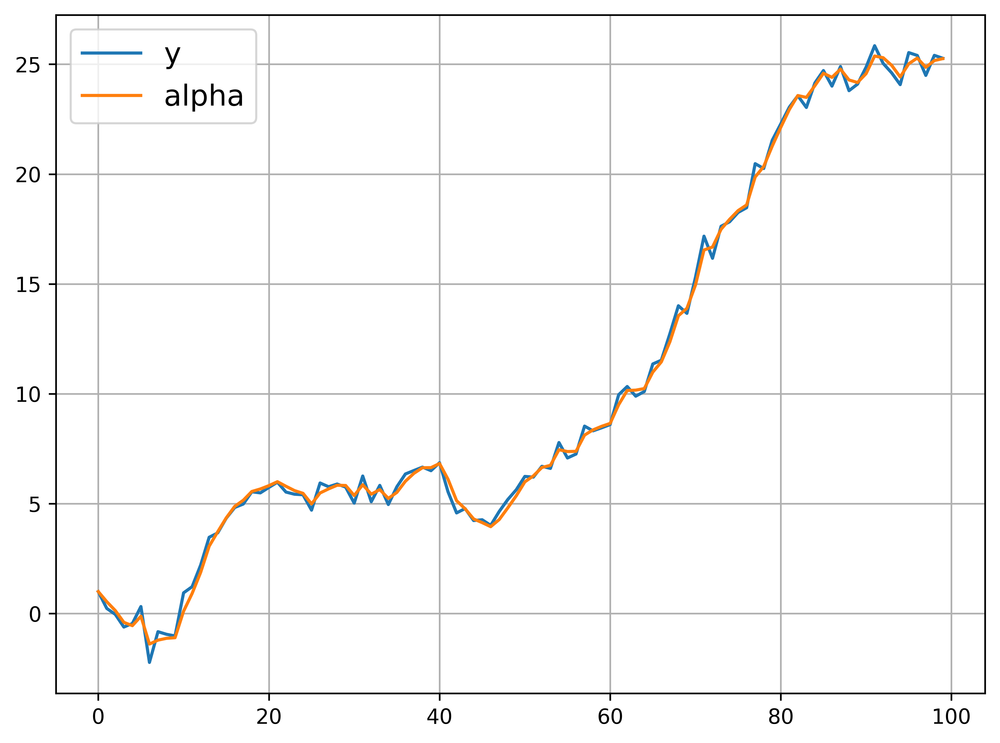


### estimate parameter


```python
def Damped_Single_source_error(params,y):
    n = len(y)
    a = [y[0]]
    b = [0]
    e = [0] #zero means null here
    gamma = abs(params[0])
    theta = abs(params[1])
    phi = abs(params[2])
    result = 0
    for t in range(1,n):
        e.append(y[t]-a[t-1]-phi*b[t-1])
        a.append(a[t-1]+phi*b[t-1]+gamma*e[t])
        b.append(phi*b[t-1]+theta*e[t])
        result +=(y[t]-a[t-1]-phi*b[t-1])**2
    return result/n
```


```python
import pandas as pd
from scipy.optimize import minimize

np.random.seed(66)
n = 10000
sigmae = np.sqrt(0.5) * np.random.randn(n)
gamma = 0.6
theta = 0.2
phi = 0.93
y = [sigmae[0]]
alpha = [sigmae[0]]
beta = [0]
for t in range(1, n):
    beta.append(phi * beta[t - 1] + theta * sigmae[t])
    alpha.append(alpha[t - 1] + phi * beta[t - 1] + gamma * sigmae[t])
    y.append(alpha[t - 1] + phi * beta[t - 1] + sigmae[t])
params = [gamma, theta, phi]

res_Damped_Single_source_error = minimize(Damped_Single_source_error, params, y, method = 'Nelder-Mead')
print(res_Damped_Single_source_error)

output_Estmate = pd.Series()
output_Estmate['gamma'] = abs(res_Damped_Single_source_error.x[0])
output_Estmate['theta'] = abs(res_Damped_Single_source_error.x[1])
output_Estmate['phi'] = abs(res_Damped_Single_source_error.x[2])

output_True = pd.Series()
output_True['gamma'] = 0.6
output_True['theta'] = 0.2
output_True['phi'] = 0.93

output = pd.DataFrame()
output['Estimate Param'] = output_Estmate
output['Ture Param'] = output_True
output
```

     final_simplex: (array([[0.61875797, 0.18758193, 0.93267852],
           [0.61885374, 0.18759508, 0.9326846 ],
           [0.61875421, 0.18762666, 0.93264929],
           [0.61876648, 0.18757831, 0.93265815]]), array([0.49905564, 0.49905565, 0.49905565, 0.49905565]))
               fun: 0.4990556443269297
           message: 'Optimization terminated successfully.'
              nfev: 69
               nit: 34
            status: 0
           success: True
                 x: array([0.61875797, 0.18758193, 0.93267852])
    

    c:\users\jx_g\appdata\local\programs\python\python36\lib\site-packages\ipykernel_launcher.py:22: DeprecationWarning: The default dtype for empty Series will be 'object' instead of 'float64' in a future version. Specify a dtype explicitly to silence this warning.
    c:\users\jx_g\appdata\local\programs\python\python36\lib\site-packages\ipykernel_launcher.py:27: DeprecationWarning: The default dtype for empty Series will be 'object' instead of 'float64' in a future version. Specify a dtype explicitly to silence this warning.
    


<div>
<style scoped>
    .dataframe tbody tr th:only-of-type {
        vertical-align: middle;
    }

    .dataframe tbody tr th {
        vertical-align: top;
    }

    .dataframe thead th {
        text-align: right;
    }
</style>
<table border="1" class="dataframe">
  <thead>
    <tr style="text-align: right;">
      <th></th>
      <th>Estimate Param</th>
      <th>Ture Param</th>
    </tr>
  </thead>
  <tbody>
    <tr>
      <th>gamma</th>
      <td>0.618758</td>
      <td>0.60</td>
    </tr>
    <tr>
      <th>theta</th>
      <td>0.187582</td>
      <td>0.20</td>
    </tr>
    <tr>
      <th>phi</th>
      <td>0.932679</td>
      <td>0.93</td>
    </tr>
  </tbody>
</table>
</div>


# Seasonality
## Additive seasonality


```python
import numpy as np

np.random.seed(1213)
n = 102
sigmae = np.sqrt(0.5)*np.random.randn(n)
sigmau = np.sqrt(0.1)*np.random.randn(n)
y = []
alpha = []
seasfactor = [5, -4, 2, -3]
s = 4
seasonal = []

for i in range(n):
    seasonal.append(seasfactor[i % s])
    
y.append(sigmae[0]+seasonal[0])
alpha.append(sigmau[0])

for t in range(1,n):
    y.append(seasonal[t]+alpha[t-1]+sigmae[t])
    alpha.append(alpha[t-1]+sigmau[t])
```

### plot series


```python
import matplotlib.pyplot as plt

plt.figure(figsize=(8, 6), dpi=600)
plt.plot(y, label="y")
plt.plot(alpha, label="alpha")
plt.legend(fontsize=14)
plt.grid()
plt.show()
```


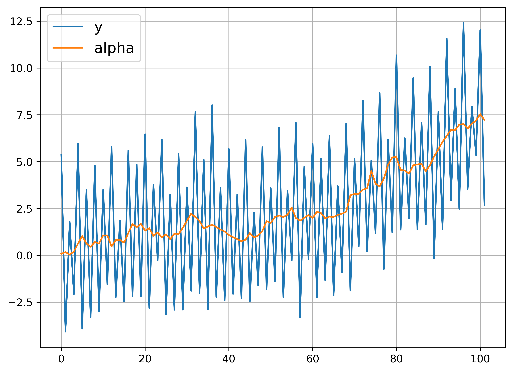


### Subtract the CMA(centered moving average) from the original series


```python
import pandas as pd
y = [6, 2, 1, 3, 7, 3, 2, 4]
cma = np.zeros(8)
cma[2] = (0.5 * y[0] + y[1] + y[2] + y[3] + 0.5 * y[4]) / 4
cma[3] = (0.5 * y[1] + y[2] + y[3] + y[4] + 0.5 * y[5]) / 4
cma[4] = (0.5 * y[2] + y[3] + y[4] + y[5] + 0.5 * y[6]) / 4
cma[5] = (0.5 * y[3] + y[4] + y[5] + y[6] + 0.5 * y[7]) / 4
residuals = y - cma

out_put = pd.DataFrame()
out_put['y'] = y
out_put['CMA'] = cma
out_put['residuals'] = residuals
out_put
```


<div>
<style scoped>
    .dataframe tbody tr th:only-of-type {
        vertical-align: middle;
    }

    .dataframe tbody tr th {
        vertical-align: top;
    }

    .dataframe thead th {
        text-align: right;
    }
</style>
<table border="1" class="dataframe">
  <thead>
    <tr style="text-align: right;">
      <th></th>
      <th>y</th>
      <th>CMA</th>
      <th>residuals</th>
    </tr>
  </thead>
  <tbody>
    <tr>
      <th>0</th>
      <td>6</td>
      <td>0.000</td>
      <td>6.000</td>
    </tr>
    <tr>
      <th>1</th>
      <td>2</td>
      <td>0.000</td>
      <td>2.000</td>
    </tr>
    <tr>
      <th>2</th>
      <td>1</td>
      <td>3.125</td>
      <td>-2.125</td>
    </tr>
    <tr>
      <th>3</th>
      <td>3</td>
      <td>3.375</td>
      <td>-0.375</td>
    </tr>
    <tr>
      <th>4</th>
      <td>7</td>
      <td>3.625</td>
      <td>3.375</td>
    </tr>
    <tr>
      <th>5</th>
      <td>3</td>
      <td>3.875</td>
      <td>-0.875</td>
    </tr>
    <tr>
      <th>6</th>
      <td>2</td>
      <td>0.000</td>
      <td>2.000</td>
    </tr>
    <tr>
      <th>7</th>
      <td>4</td>
      <td>0.000</td>
      <td>4.000</td>
    </tr>
  </tbody>
</table>
</div>


### Average the elements of $residualst$ by season and obtain the seasonal factor


```python
factors = [residuals[4], residuals[5], residuals[2], residuals[3],
           residuals[4], residuals[5], residuals[2], residuals[3]]
newseries = []
for i in range(len(factors)):
    newseries.append(y[i] - factors[i])
```


```python
import matplotlib.pyplot as plt

plt.figure(figsize=(8, 6), dpi=600)
plt.plot(y, label="y")
plt.plot(newseries, '--', label="newseries")
plt.legend(fontsize=14)
plt.grid()
plt.show()
```


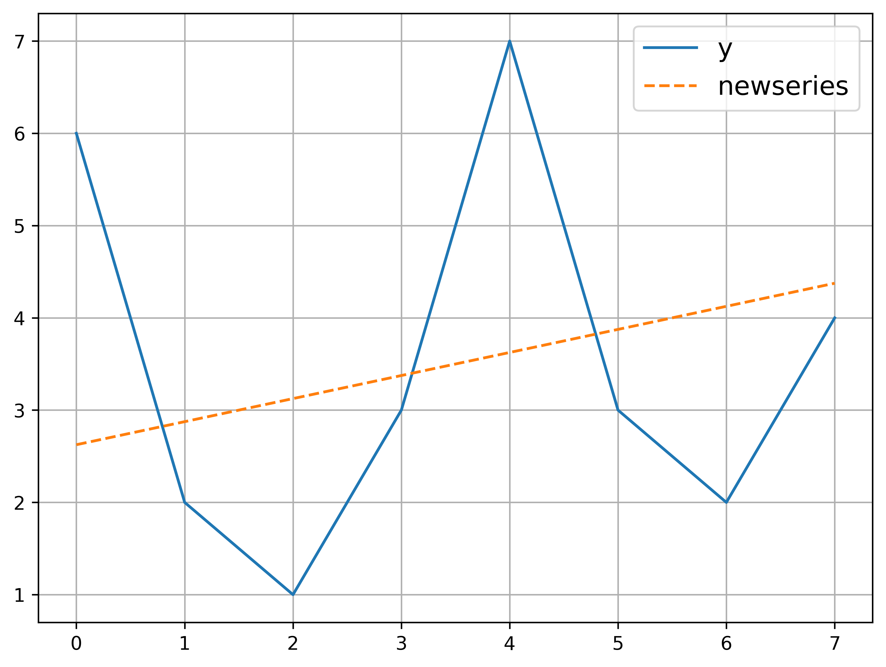


### generate a series and implement the process of taking out the seasonal component


```python
import numpy as np

np.random.seed(243)
n = 87
sigmae = np.sqrt(0.3) * np.random.randn(n)
sigmau = np.sqrt(0.1) * np.random.randn(n)
y = []
alpha = []
factor = [5, -4, 2, -3]
s = 4
seasonal = []

for i in range(n):
    seasonal.append(factor[i % s])

y.append(sigmae[0] + seasonal[0])
alpha.append(sigmau[0])

for t in range(1, n):
    y.append(seasonal[t] + alpha[t - 1] + sigmae[t])
    alpha.append(alpha[t - 1] + sigmau[t])
```


```python
import pandas as pd
w = []
for i in range(s + 1):
    w.append(1 / (2 * s))
for i in range(1, s):
    w[i] = 1 / s

cma = np.zeros(len(y))

for g in range(len(y) - s):
    for i in range(s + 1):
        cma[int(g + s / 2)] += w[i] * y[g + i]

residuals = y - cma
pd.Series(residuals)
```


    0     5.346641
    1    -4.980354
    2     0.894582
    3    -1.961655
    4     5.053341
            ...   
    82    1.773388
    83   -2.606990
    84    5.559848
    85   -4.120238
    86    2.294194
    Length: 87, dtype: float64


```python
factors = []
for seas in range(s):
    num = seas
    temp = []
    while num < (len(y) - 1):
        if (num < 2 or num > (len(y) - 3)):
            num += 4
            continue
        else:
            temp.append(residuals[num])
            num += 4
    factors.append(np.mean(temp))
newseries = []
for i in range(n):
    newseries.append(y[i] - factors[i % s])
```


```python
import matplotlib.pyplot as plt

plt.figure(figsize=(8, 6), dpi=600)
plt.plot(newseries, label="newseries")
plt.plot(alpha + sigmae, '--', label="alpha + sigmae")
plt.legend(fontsize=14)
plt.grid()
plt.show()
```


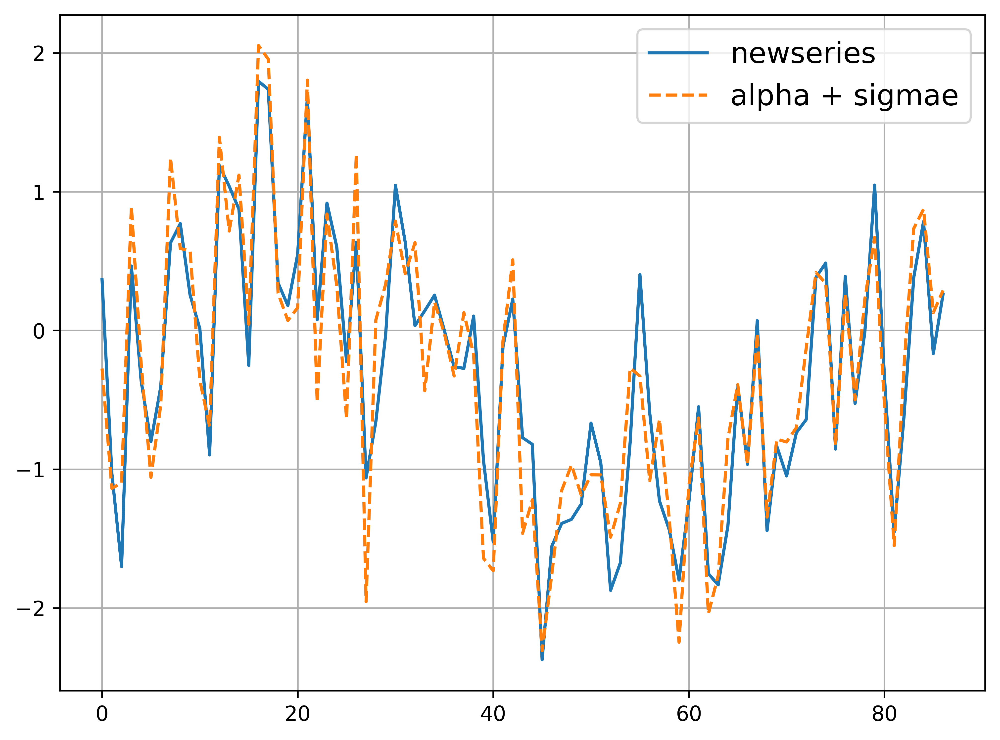


## multiplicative seasonality


```python
import numpy as np

np.random.seed(7)
n = 103
sigmae = np.sqrt(0.5)*np.random.randn(n)
sigmau = np.sqrt(0.4)*np.random.randn(n)
y = []
alpha = []
factor = [1.7,0.3,1.9,0.1]
seasonal = []

for i in range(n):
    seasonal.append(factor[i%s])
y.append(sigmae[0])
alpha.append(5+sigmau[0])

for t in range(1,n):
    y.append(seasonal[t]*(alpha[t-1]+sigmae[t]))
    alpha.append(alpha[t-1]+sigmau[t])
```


```python
import matplotlib.pyplot as plt

plt.figure(figsize=(8, 6), dpi=600)
plt.plot(y, label="y")
plt.plot(alpha, '--', label="alpha")
plt.legend(fontsize=14)
plt.grid()
plt.show()
```


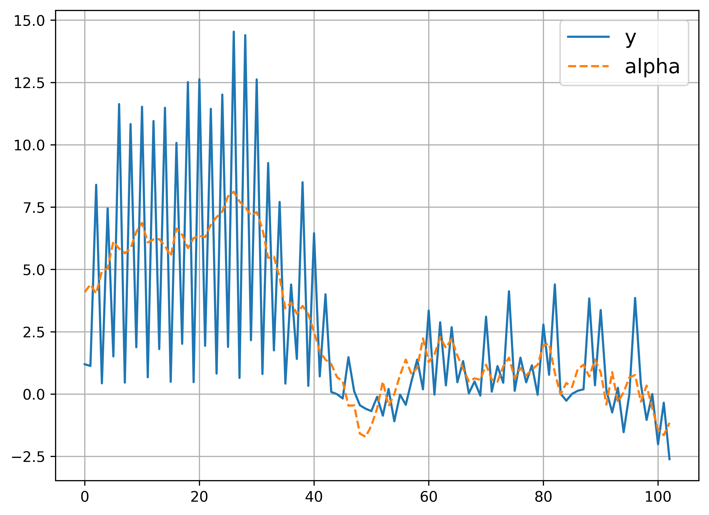


```python
import numpy as np

np.random.seed(7)
n = 103
sigmae = np.sqrt(0.5)*np.random.randn(n)
sigmau = np.sqrt(0.4)*np.random.randn(n)
y = []
alpha = []
factor = [1.7,0.3,1.9,0.1]
seasonal = []
for i in range(n):
    seasonal.append(factor[i%s])
y.append(sigmae[0])
alpha.append(5+sigmau[0])
for t in range(1,n):
    y.append(seasonal[t]*(alpha[t-1]+sigmae[t]))
    alpha.append(alpha[t-1]+sigmau[t])
s = 4
n = len(y)
w = []
for i in range(s+1):
    w.append(1/(2*s))
for i in range(1,s):
    w[i] = 1/s
cma = np.zeros(len(y))
for g in range(len(y)-s):
    for i in range(s+1):
        cma[int(g+s/2)] += w[i]*y[g+i]
residuals = y / cma
factors = []
for seas in range(s):
    num = seas
    temp = []
    while num<(len(y)-1):
        if (num<2 or num>(len(y)-3)):
            num+=4
            continue
        else:
            temp.append(residuals[num])
            num+=4
    factors.append(np.mean(temp))
sfactors = [i*4/sum(factors) for i in factors]
newseries = []
for i in range(n):
    newseries.append(y[i]/sfactors[i%s])
```

    c:\users\jx_g\appdata\local\programs\python\python36\lib\site-packages\ipykernel_launcher.py:29: RuntimeWarning: divide by zero encountered in true_divide
    


```python
import matplotlib.pyplot as plt

plt.figure(figsize=(8, 6), dpi=600)
plt.plot(newseries, label="newseries")
plt.plot(alpha+sigmae, '--', label="alpha+sigmae")
plt.legend(fontsize=14)
plt.grid()
plt.show()

```


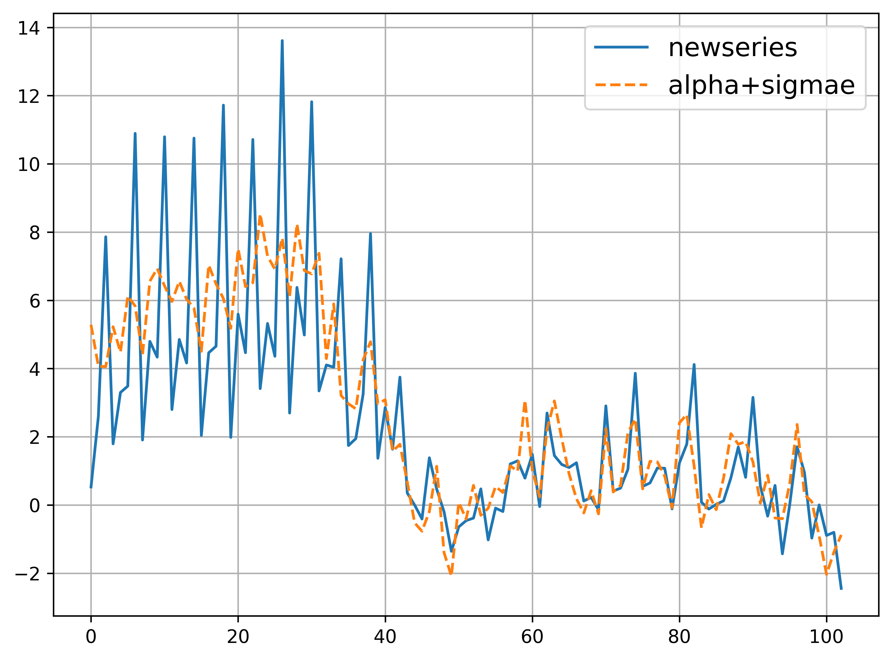


# Seasonal-state-Space representation


```python
import numpy as np

np.random.seed(55)
n = 100
sigmae = np.sqrt(0.4)*np.random.randn(n)
y = []
alpha = []
s = 4
gamma = 0.3
sfactor = 10 * np.random.randn(s)
for i in range(4):
    y.append(sfactor[i]+sigmae[i])
    alpha.append(sfactor[i] + 0.2 * sigmae[i])
for t in range(4,n):
    alpha.append(alpha[t-s] + gamma * sigmae[t])
    y.append(alpha[t-s]+sigmae[t])
```


```python
import matplotlib.pyplot as plt

plt.figure(figsize=(8, 6), dpi=600)
plt.plot(y, label="y")
plt.plot(alpha, '--', label="alpha")
plt.legend(fontsize=14)
plt.grid()
plt.show()
```


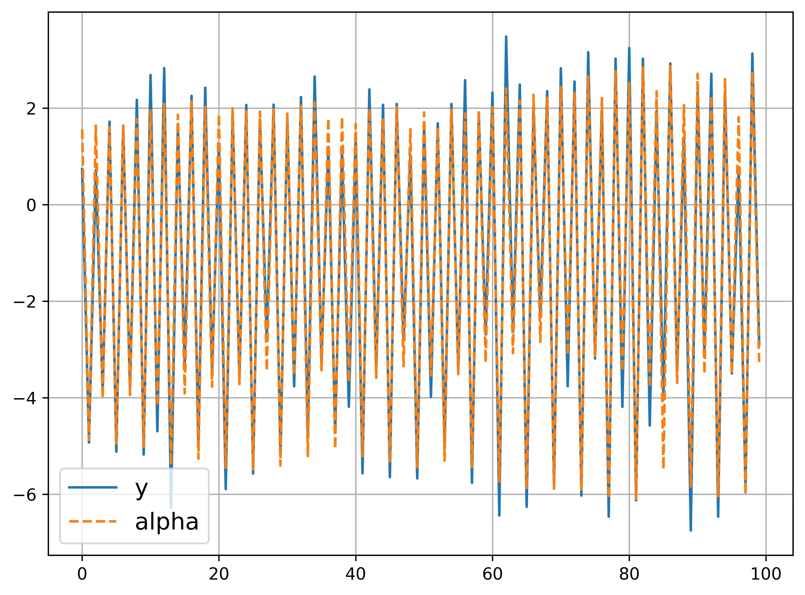


```python
import numpy as np

np.random.seed(55)
n = 12000
sigmae = np.sqrt(0.4)*np.random.randn(n)
y = []
alpha = []
s = 4
gamma = 0.3
sfactor = 10 * np.random.randn(s)
for i in range(4):
    y.append(sfactor[i]+sigmae[i])
    alpha.append(sfactor[i] + 0.2 * sigmae[i])
for t in range(4,n):
    alpha.append(alpha[t-s] + gamma * sigmae[t])
    y.append(alpha[t-s]+sigmae[t])
s = 4
state = np.zeros(n)
e = np.zeros(n)
state[0:3] = y[0:3]
```


```python
def log_Lik_Conc(params,y):
    gamma = abs(params)
    for t in range(s,n):
        e[t] = y[t]-state[t-s]
        state[t] = state[t-s]+gamma*e[t]
    sum = 0
    for i in range(1,n):
        sum += e[i]*e[i]/(n-1)
    return sum
```


```python
import pandas as pd
from scipy.optimize import minimize

params = 0.2
res_log_Lik_Conc = minimize(log_Lik_Conc, params, y, method = 'Nelder-Mead')
print(res_log_Lik_Conc)

output_Estmate = pd.Series()
output_Estmate['gamma'] = abs(res_log_Lik_Conc.x[0])

output_True = pd.Series()
output_True['gamma'] = 0.3

output = pd.DataFrame()
output['Estimate Param'] = output_Estmate
output['Ture Param'] = output_True
output

```

     final_simplex: (array([[0.34640625],
           [0.34632813]]), array([0.41230753, 0.41230753]))
               fun: 0.4123075335857137
           message: 'Optimization terminated successfully.'
              nfev: 28
               nit: 14
            status: 0
           success: True
                 x: array([0.34640625])
    

    c:\users\jx_g\appdata\local\programs\python\python36\lib\site-packages\ipykernel_launcher.py:8: DeprecationWarning: The default dtype for empty Series will be 'object' instead of 'float64' in a future version. Specify a dtype explicitly to silence this warning.
      
    c:\users\jx_g\appdata\local\programs\python\python36\lib\site-packages\ipykernel_launcher.py:11: DeprecationWarning: The default dtype for empty Series will be 'object' instead of 'float64' in a future version. Specify a dtype explicitly to silence this warning.
      # This is added back by InteractiveShellApp.init_path()
    


<div>
<style scoped>
    .dataframe tbody tr th:only-of-type {
        vertical-align: middle;
    }

    .dataframe tbody tr th {
        vertical-align: top;
    }

    .dataframe thead th {
        text-align: right;
    }
</style>
<table border="1" class="dataframe">
  <thead>
    <tr style="text-align: right;">
      <th></th>
      <th>Estimate Param</th>
      <th>Ture Param</th>
    </tr>
  </thead>
  <tbody>
    <tr>
      <th>gamma</th>
      <td>0.346406</td>
      <td>0.3</td>
    </tr>
  </tbody>
</table>
</div>


## Suppose we want to generate a local level with drift (the model underlying the Theta method)np.random.seed(1132)


```python
import numpy as np

np.random.seed(1132)
n = 100
sigmae = np.sqrt(0.4)*np.random.randn(n)
y = []
alpha = []
s = 4
co = 0.3
sfactor = 10 * np.random.rand(s)

for i in range(4):
    y.append(sfactor[i] + sigmae[i])
    alpha.append(sfactor[i] + sigmae[i])

for t in range(4,n):
    alpha.append(co + alpha[t-s] + 0.1 * sigmae[t])
    y.append(alpha[t - s] + sigmae[t])
```


```python
import matplotlib.pyplot as plt

plt.figure(figsize=(8, 6), dpi=600)
plt.plot(y, label="y")
plt.plot(alpha, '--', label="alpha")
plt.legend(fontsize=14)
plt.grid()
plt.show()
```


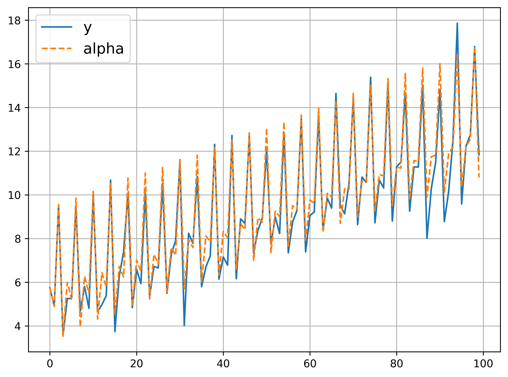


```python
np.random.seed(1132)
n = 12000
sigmae = np.sqrt(0.4)*np.random.randn(n)
y = []
alpha = []
s = 4
co = 0.3
sfactor = 10*np.random.rand(s)
for i in range(4):
    y.append(sfactor[i]+sigmae[i])
    alpha.append(sfactor[i]+sigmae[i])
for t in range(4,n):
    alpha.append(co+alpha[t-s]+0.1*sigmae[t])
    y.append(alpha[t-s]+sigmae[t])
```


```python
def log_Lik_Conc(params,y,s):
    gamma = abs(params[0])
    co = abs(params[1])
    state = np.zeros(n)
    e = np.zeros(n)
    state[0:3] = y[0:3]
    for t in range(s,n):
        e[t] = y[t]-state[t-s]
        state[t] = co+state[t-s]+gamma*e[t]
    sum = 0
    for i in range(1,n):
        sum+=e[i]*e[i]/(n-1)
    return sum
```


```python
import pandas as pd
from scipy.optimize import minimize

s = 4
gamma = 0.1
co = 0.3
params = [gamma, co]
res_log_Lik_Conc = minimize(fun = log_Lik_Conc,
                            x0 = params,
                            args = (y, s),
                            method = 'Nelder-Mead')
print(res_log_Lik_Conc)

output_Estmate = pd.Series()
output_Estmate['gamma'] = abs(res_log_Lik_Conc.x[0])
output_Estmate['const'] = abs(res_log_Lik_Conc.x[1])

output_True = pd.Series()
output_True['gamma'] = 0.1
output_True['const'] = 0.3

output = pd.DataFrame()
output['Estimate Param'] = output_Estmate
output['Ture Param'] = output_True
output


```

     final_simplex: (array([[0.10391145, 0.30089203],
           [0.10399237, 0.30089611],
           [0.10394168, 0.30086527]]), array([0.40314089, 0.4031409 , 0.40314092]))
               fun: 0.4031408864134758
           message: 'Optimization terminated successfully.'
              nfev: 35
               nit: 18
            status: 0
           success: True
                 x: array([0.10391145, 0.30089203])
    

    c:\users\jx_g\appdata\local\programs\python\python36\lib\site-packages\ipykernel_launcher.py:14: DeprecationWarning: The default dtype for empty Series will be 'object' instead of 'float64' in a future version. Specify a dtype explicitly to silence this warning.
      
    c:\users\jx_g\appdata\local\programs\python\python36\lib\site-packages\ipykernel_launcher.py:18: DeprecationWarning: The default dtype for empty Series will be 'object' instead of 'float64' in a future version. Specify a dtype explicitly to silence this warning.
    


<div>
<style scoped>
    .dataframe tbody tr th:only-of-type {
        vertical-align: middle;
    }

    .dataframe tbody tr th {
        vertical-align: top;
    }

    .dataframe thead th {
        text-align: right;
    }
</style>
<table border="1" class="dataframe">
  <thead>
    <tr style="text-align: right;">
      <th></th>
      <th>Estimate Param</th>
      <th>Ture Param</th>
    </tr>
  </thead>
  <tbody>
    <tr>
      <th>gamma</th>
      <td>0.103911</td>
      <td>0.1</td>
    </tr>
    <tr>
      <th>const</th>
      <td>0.300892</td>
      <td>0.3</td>
    </tr>
  </tbody>
</table>
</div>


# Forecasting time series
## generate the series


```python
import numpy as np
np.random.seed(1347)
n = 105
sigmae = np.sqrt(0.5)*np.random.randn(n)
sigmau = np.sqrt(0.1)*np.random.randn(n)
y = [sigmae[0]]
alpha = [sigmau[0]]
co = 0.06
for t in range(1,n):
    alpha.append(co+alpha[t-1]+sigmau[t])
    y.append(alpha[t-1]+sigmae[t])
```

## plot the series


```python
import matplotlib.pyplot as plt

plt.figure(figsize=(8, 6), dpi=600)
plt.plot(y, label="y")
plt.plot(alpha, '--', label="alpha")
plt.legend(fontsize=14)
plt.grid()
plt.show()
```


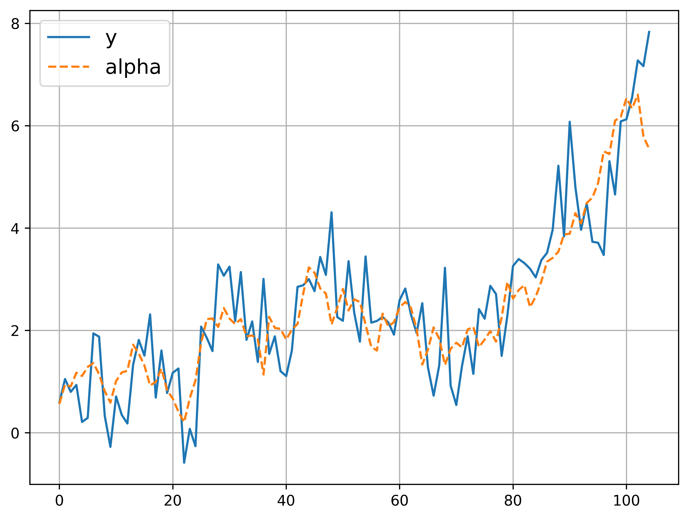


## generate long series


```python
import numpy as np
np.random.seed(1347)
n = 10000+5
sigmae = np.sqrt(0.5)*np.random.randn(n)
sigmau = np.sqrt(0.1)*np.random.randn(n)
y = [sigmae[0]]
alpha = [sigmau[0]]
co = 0.06
for t in range(1,n):
    alpha.append(co+alpha[t-1]+sigmau[t])
    y.append(alpha[t-1]+sigmae[t])
```

## estimate param


```python
def func_Theta(params, y, n):
    q = abs(params[0])
    co = abs(params[1])
    z = 1
    w = 1
    obs = n
    sigmae = 0
    likelihood = 0
    x = y[0:obs]
    a = [x[0]]
    p = [10000]
    k = [0]
    v = [0]
    for t in range(1, obs):
        k.append((z * w * p[t - 1]) / (z * z * p[t - 1] + 1))
        p.append(w * w * p[t - 1] - w * z * k[t] * p[t - 1] + q)
        v.append(x[t] - z * a[t - 1])
        a.append(co + w * a[t - 1] + k[t] * v[t])
        sigmae += (v[t] * v[t]) / (z * z * p[t - 1] + 1)
        likelihood += 0.5 * np.log(2 * np.pi) + 0.5 + \
            0.5 * np.log(z * z * p[t - 1] + 1)
    likelihood += 0.5 * n * np.log(sigmae / n)
    return likelihood
```


```python
import pandas as pd
from scipy.optimize import minimize

q = 0.2
co = 0.1
params = [q,co]
res_func_Theta = minimize(fun=func_Theta,
                          x0= params,
                          args=(y,10000),
                          method = 'Nelder-Mead')
print(res_func_Theta)

output_Estmate = pd.Series()
output_Estmate['q'] = abs(res_func_Theta.x[0])
output_Estmate['const'] = abs(res_func_Theta.x[1])

output_True = pd.Series()
output_True['q'] = 0.2
output_True['const'] = 0.1

output = pd.DataFrame()
output['Estimate Param'] = output_Estmate
output['Ture Param'] = output_True
output
```

     final_simplex: (array([[0.21249589, 0.06179446],
           [0.21239865, 0.06181234],
           [0.21255947, 0.06181416]]), array([12912.5930174 , 12912.59303842, 12912.59304649]))
               fun: 12912.593017404506
           message: 'Optimization terminated successfully.'
              nfev: 59
               nit: 31
            status: 0
           success: True
                 x: array([0.21249589, 0.06179446])
    

    c:\users\jx_g\appdata\local\programs\python\python36\lib\site-packages\ipykernel_launcher.py:13: DeprecationWarning: The default dtype for empty Series will be 'object' instead of 'float64' in a future version. Specify a dtype explicitly to silence this warning.
      del sys.path[0]
    c:\users\jx_g\appdata\local\programs\python\python36\lib\site-packages\ipykernel_launcher.py:17: DeprecationWarning: The default dtype for empty Series will be 'object' instead of 'float64' in a future version. Specify a dtype explicitly to silence this warning.
    


<div>
<style scoped>
    .dataframe tbody tr th:only-of-type {
        vertical-align: middle;
    }

    .dataframe tbody tr th {
        vertical-align: top;
    }

    .dataframe thead th {
        text-align: right;
    }
</style>
<table border="1" class="dataframe">
  <thead>
    <tr style="text-align: right;">
      <th></th>
      <th>Estimate Param</th>
      <th>Ture Param</th>
    </tr>
  </thead>
  <tbody>
    <tr>
      <th>q</th>
      <td>0.212496</td>
      <td>0.2</td>
    </tr>
    <tr>
      <th>const</th>
      <td>0.061794</td>
      <td>0.1</td>
    </tr>
  </tbody>
</table>
</div>


```python
q = res_func_Theta.x[0]
co = res_func_Theta.x[1]
obs = 10000
x = y[0:obs]
a = [x[0]]
p = [10000]
k = [0]
v = [0]
z = 1
w = 1
sigmae = 0

for t in range(1, obs):
    k.append((z * w * p[t - 1]) / (z * z * p[t - 1] + 1))
    p.append(w * w * p[t - 1] - w * z * k[t] * p[t - 1] + q)
    v.append(y[t] - z * a[t - 1])
    a.append(co + w * a[t - 1] + k[t] * v[t])
    sigmae += v[t] * v[t] / (z * z * p[t] + 1)
sigmae_estimated = sigmae / (obs - 1)
sigmau_estimated = q * sigmae_estimated

output_Estmate = pd.Series()
output_Estmate['sigmae'] = sigmae_estimated
output_Estmate['sigmau'] = sigmau_estimated

output_True = pd.Series()
output_True['sigmae'] = 0.5
output_True['sigmau'] = 0.1

output = pd.DataFrame()
output['Estimate Param'] = output_Estmate
output['Ture Param'] = output_True
output
```

    c:\users\jx_g\appdata\local\programs\python\python36\lib\site-packages\ipykernel_launcher.py:22: DeprecationWarning: The default dtype for empty Series will be 'object' instead of 'float64' in a future version. Specify a dtype explicitly to silence this warning.
    c:\users\jx_g\appdata\local\programs\python\python36\lib\site-packages\ipykernel_launcher.py:26: DeprecationWarning: The default dtype for empty Series will be 'object' instead of 'float64' in a future version. Specify a dtype explicitly to silence this warning.
    


<div>
<style scoped>
    .dataframe tbody tr th:only-of-type {
        vertical-align: middle;
    }

    .dataframe tbody tr th {
        vertical-align: top;
    }

    .dataframe thead th {
        text-align: right;
    }
</style>
<table border="1" class="dataframe">
  <thead>
    <tr style="text-align: right;">
      <th></th>
      <th>Estimate Param</th>
      <th>Ture Param</th>
    </tr>
  </thead>
  <tbody>
    <tr>
      <th>sigmae</th>
      <td>0.490258</td>
      <td>0.5</td>
    </tr>
    <tr>
      <th>sigmau</th>
      <td>0.104178</td>
      <td>0.1</td>
    </tr>
  </tbody>
</table>
</div>


## Forecast


```python
MyForecasts = np.zeros(5)
MyForecasts[0] = a[obs-1]
MyForecasts[1] = co + MyForecasts[0]
MyForecasts[2] = co + MyForecasts[1]
MyForecasts[3] = co + MyForecasts[2]
MyForecasts[4] = co + MyForecasts[3]
```

## plot forecasted series


```python
import matplotlib.pyplot as plt

plt.figure(figsize=(8, 6), dpi=600)
plt.plot(y[10000:10004], label="y")
plt.plot(MyForecasts, '--', label="MyForecasts")
plt.legend(fontsize=14)
plt.grid()
plt.show()

```


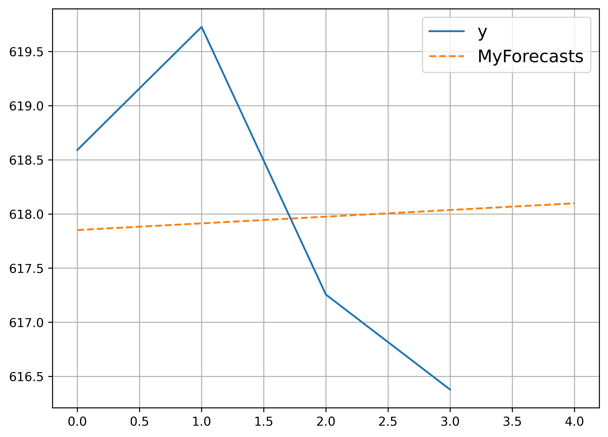


# Forecasting seasonal series
Now consider the case of series affected by a seasonal factor. Suppose we wish to forecast the last 6 observations of this series (considering that we know only the first 100 observations):


```python
import numpy as np

np.random.seed(4241)
n = 1293
h = 6
e = np.sqrt(0.4)*np.random.randn(n)
u = np.sqrt(0.1)*np.random.randn(n)
my = np.zeros(n)
alpha = np.zeros(n)
con = 0.03
factor = [0.3,0.9,1.3,1.5]
seasonal = list()
for i in range(n):
    seasonal.append(factor[i%4])
my[0] = e[0]
alpha[0] = u[0]
for t in range(1,n):
    my[t] = seasonal[t] * (alpha[t-1] + e[t])
    alpha[t] = con + alpha[t-1]+u[t]
```


```python
import matplotlib.pyplot as plt

yy = my[299:397]
plt.figure(figsize=(8, 6), dpi=600)
plt.plot(yy, label="yy")
plt.legend(fontsize=14)
plt.grid()
plt.show()
```


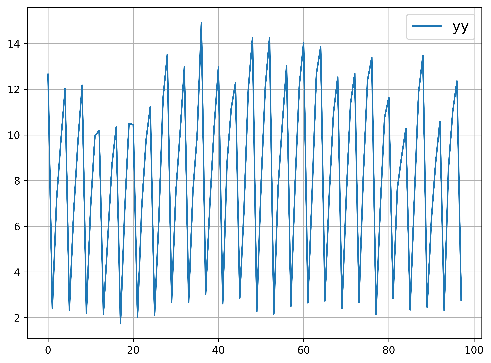


In this example we suppose we know the first 100 observations and we leave the other 6 as forecasting sample.


```python
y = my[0:(len(my)-h)-1]
s = 4
n = len(y)
w = []
for i in range(s+1):
    w.append(1/(2*s))
for i in range(1,s):
    w[i] = 1/s
cma = np.zeros(len(y))
for g in range(len(y)-s):
    for i in range(s+1):
        cma[int(g+s/2)] += w[i]*y[g+i]
residuals = y/cma
factors = []
for seas in range(s):
    num = seas
    temp = []
    while num<(len(y)-1):
        if (num<2 or num>(len(y)-3)):
            num+=4
            continue
        else:
            temp.append(residuals[num])
            num+=4
    factors.append(np.mean(temp))
sfactors = [i*4/sum(factors) for i in factors]
newseries = []
for i in range(n):
    newseries.append(y[i]/sfactors[i%s])
```

    c:\users\jx_g\appdata\local\programs\python\python36\lib\site-packages\ipykernel_launcher.py:13: RuntimeWarning: divide by zero encountered in true_divide
      del sys.path[0]
    

We can now forecast the newly deseasonalised series and then multiply the forecast by the factors to obtain
the seasonal forecasts. The code below makes the trick:


```python
def funcTheta(params, newseries):
    q = abs(params[0])
    co = abs(params[1])
    n = len(newseries)
    a = [newseries[0]]
    p = [10000]
    k = [0]
    v = [0]
    z = 1
    w = 1
    sigmae = 0
    likelihood = 0
    for t in range(1, n):
        k.append((z * w * p[t - 1]) / (z * z * p[t - 1] + 1))
        p.append(w * w * p[t - 1] - w * z * k[t] * p[t - 1] + q)
        v.append(newseries[t] - z * a[t - 1])
        a.append(co + w * a[t - 1] + k[t] * v[t])
        sigmae += (v[t] * v[t]) / (z * z * p[t - 1] + 1)
        likelihood += 0.5 * np.log(2 * np.pi) + 0.5 + \
            0.5 * np.log(z * z * p[t - 1] + 1)
    likelihood += 0.5 * n * np.log(sigmae / n)
    return likelihood
```


```python
import pandas as pd
from scipy.optimize import minimize

q = 0.25
co = 0.03
param = [q, co]
res_funcTheta = minimize(fun = funcTheta,
                         x0 = param,
                         args = newseries,
                         method = 'Nelder-Mead')
print(res_funcTheta)

output_Estmate = pd.Series()
output_Estmate['q'] = abs(res_funcTheta.x[0])
output_Estmate['co'] = abs(res_funcTheta.x[1])

output_True = pd.Series()
output_True['q'] = 0.25
output_True['co'] = 0.03


output = pd.DataFrame()
output['Estimate Param'] = output_Estmate
output['Ture Param'] = output_True
output
```

     final_simplex: (array([[0.26242332, 0.0373685 ],
           [0.2623403 , 0.03738847],
           [0.26245285, 0.03738896]]), array([1577.11001542, 1577.1100155 , 1577.11001712]))
               fun: 1577.1100154184464
           message: 'Optimization terminated successfully.'
              nfev: 40
               nit: 20
            status: 0
           success: True
                 x: array([0.26242332, 0.0373685 ])
    

    c:\users\jx_g\appdata\local\programs\python\python36\lib\site-packages\ipykernel_launcher.py:13: DeprecationWarning: The default dtype for empty Series will be 'object' instead of 'float64' in a future version. Specify a dtype explicitly to silence this warning.
      del sys.path[0]
    c:\users\jx_g\appdata\local\programs\python\python36\lib\site-packages\ipykernel_launcher.py:17: DeprecationWarning: The default dtype for empty Series will be 'object' instead of 'float64' in a future version. Specify a dtype explicitly to silence this warning.
    


<div>
<style scoped>
    .dataframe tbody tr th:only-of-type {
        vertical-align: middle;
    }

    .dataframe tbody tr th {
        vertical-align: top;
    }

    .dataframe thead th {
        text-align: right;
    }
</style>
<table border="1" class="dataframe">
  <thead>
    <tr style="text-align: right;">
      <th></th>
      <th>Estimate Param</th>
      <th>Ture Param</th>
    </tr>
  </thead>
  <tbody>
    <tr>
      <th>q</th>
      <td>0.262423</td>
      <td>0.25</td>
    </tr>
    <tr>
      <th>co</th>
      <td>0.037368</td>
      <td>0.03</td>
    </tr>
  </tbody>
</table>
</div>


```python
q = res_funcTheta.x[0]
co = res_funcTheta.x[1]
n = len(newseries)
a = [newseries[0]]
p = [10000]
k = [0]
v = [0]
z = 1
w = 1
sigmae = 0
for t in range(1, n):
    k.append((z * w * p[t - 1]) / (z * z * p[t - 1] + 1))
    p.append(w * w * p[t - 1] - w * z * k[t] * p[t - 1] + q)
    v.append(newseries[t] - z * a[t - 1])
    a.append(co + w * a[t - 1] + k[t] * v[t])
    sigmae += v[t] * v[t] / (z * z * p[t] + 1)
sigmae_estimated = sigmae / (n - 1)
sigmau_estimated = q * sigmae_estimated
print(sigmae_estimated)
print(sigmau_estimated)

output_Estmate = pd.Series()
output_Estmate['sigmae'] = sigmae_estimated
output_Estmate['sigmau'] = sigmau_estimated

output_True = pd.Series()
output_True['sigmae'] = 0.4
output_True['sigmau'] = 0.1

output = pd.DataFrame()
output['Estimate Param'] = output_Estmate
output['Ture Param'] = output_True
output
```

    0.40975379056843075
    0.10752894831877301
    

    c:\users\jx_g\appdata\local\programs\python\python36\lib\site-packages\ipykernel_launcher.py:22: DeprecationWarning: The default dtype for empty Series will be 'object' instead of 'float64' in a future version. Specify a dtype explicitly to silence this warning.
    c:\users\jx_g\appdata\local\programs\python\python36\lib\site-packages\ipykernel_launcher.py:26: DeprecationWarning: The default dtype for empty Series will be 'object' instead of 'float64' in a future version. Specify a dtype explicitly to silence this warning.
    


<div>
<style scoped>
    .dataframe tbody tr th:only-of-type {
        vertical-align: middle;
    }

    .dataframe tbody tr th {
        vertical-align: top;
    }

    .dataframe thead th {
        text-align: right;
    }
</style>
<table border="1" class="dataframe">
  <thead>
    <tr style="text-align: right;">
      <th></th>
      <th>Estimate Param</th>
      <th>Ture Param</th>
    </tr>
  </thead>
  <tbody>
    <tr>
      <th>sigmae</th>
      <td>0.409754</td>
      <td>0.4</td>
    </tr>
    <tr>
      <th>sigmau</th>
      <td>0.107529</td>
      <td>0.1</td>
    </tr>
  </tbody>
</table>
</div>


```python
sfactnh = []
for i in range(n+h):
    sfactnh.append(sfactors[i%s])
sfactout = sfactnh[(len(sfactnh)-h):len(sfactnh)]
w = 1
z = 1
MyForecasts = np.zeros(h)
MyForecasts[0] = a[len(newseries)-1]
for o in range(1,h):
    MyForecasts[o] = co+MyForecasts[o-1]
SeasonalForecast = MyForecasts*sfactout
```


```python
import matplotlib.pyplot as plt
new_y = my[(len(my)-h)-1:len(my)-1]
plt.figure(figsize=(8, 6), dpi=600)
plt.plot(new_y, label="y")
plt.plot(SeasonalForecast, '--', label="SeasonalForecast")
plt.legend(fontsize=14)
plt.grid()
plt.show()
```


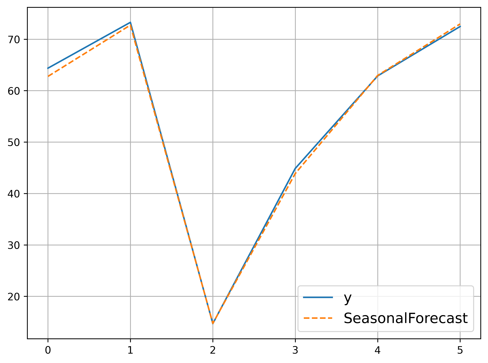


# Comparing forecasting performance

# Forecast competion in action!
## ForecastARkf


```python
import numpy as np
    
def ForecastARkf(y,h):
    def fu(mypa, y):
        q = abs(mypa[0])
        co = abs(mypa[1])
        w = 1-np.exp(-abs(mypa[2]))
        n = len(y)
        a = [y[0]]
        p = [10000]
        k = [0]
        v = [0]
        likelihood = 0
        sigmae = 0
        z = 1
        for t in range(1, n):
            k.append((z * w * p[t - 1]) / (z * z * p[t - 1] + 1))
            p.append(w * w * p[t - 1] - w * z * k[t] * p[t - 1] + q)
            v.append(y[t] - z * a[t - 1])
            a.append(co + w * a[t - 1] + k[t] * v[t])
            sigmae += v[t] * v[t] / (z * z * p[t - 1] + 1)
            likelihood += 0.5 * np.log(2 * np.pi) + 0.5 + \
                0.5 * np.log(z * z * p[t - 1] + 1)
        likelihood += 0.5 * n * np.log(sigmae / n)
        return likelihood
    q = 0.5
    co = 0.2
    w = 0.7
    param = [q,co,w]
    estimation = minimize(fun = fu,
                          x0 = param,
                          args = y,
                          method = 'Nelder-Mead')
    n = len(y)
    a = [y[0]]
    p = [10000]
    k = [0]
    v = [0]
    z = 1
    q = abs(estimation.x[0])
    co = abs(estimation.x[1])
    w = 1 - np.exp(-abs(estimation.x[2]))
    sigmae = 0
    for t in range(1, n):
        k.append((z * w * p[t - 1]) / (z * z * p[t - 1] + 1))
        p.append(w * w * p[t - 1] - w * z * k[t] * p[t - 1] + q)
        v.append(y[t] - z * a[t - 1])
        a.append(co + w * a[t - 1] + k[t] * v[t])
        sigmae += v[t] * v[t] / (z * z * p[t - 1] + 1)
    Forec = []
    Forec.append(a[len(y) - 1])
    for i in range(1, h):
        Forec.append(co + w * Forec[i - 1])
    return Forec
```

## ForecastAR


```python
def ForecastAR(y, h):
    def logLikConc(myparam, y):
        w = 1 - np.exp(-abs(myparam[0]))
        gamma = abs(myparam[1])
        co = abs(myparam[2])
        state = [y[0]]
        v = [0]
        result = 0
        for t in range(1, len(y)):
            v.append(y[t] - state[t - 1])
            state.append(co + w * state[t - 1] + gamma * v[t])
            result += v[t] * v[t]
        return result
    w = 10
    gamma = 0.3
    co = 0.8
    params = [w, gamma, co]
    estimation = minimize(fun=logLikConc,
                          x0=params,
                          args=y,
                          method='Nelder-Mead')
    w = 1 - np.exp(-abs(estimation.x[0]))
    gamma = abs(estimation.x[1])
    co = abs(estimation.x[2])
    state = [y[0]]
    v = [0]
    for t in range(1, len(y)):
        v.append(y[t] - state[t - 1])
        state.append(co + w * state[t - 1] + gamma * v[t])
    Forec = []
    Forec.append(state[len(y) - 1])
    for i in range(1, h):
        Forec.append(co + w * Forec[i - 1])
    return Forec
```

## ForecastThetakf


```python
def ForecastThetakf(y, h):
    def fu(mypa, y):
        q = abs(mypa[0])
        co = abs(mypa[1])
        w = 1
        n = len(y)
        a = [y[0]]
        p = [10000]
        k = [0]
        v = [0]
        likelihood = 0
        sigmae = 0
        z = 1
        for t in range(1, n):
            k.append((z * w * p[t - 1]) / (z * z * p[t - 1] + 1))
            p.append(w * w * p[t - 1] - w * z * k[t] * p[t - 1] + q)
            v.append(y[t] - z * a[t - 1])
            a.append(co + w * a[t - 1] + k[t] * v[t])
            sigmae += v[t] * v[t] / (z * z * p[t - 1] + 1)
            likelihood += 0.5 * np.log(2 * np.pi) + 0.5 + \
                0.5 * np.log(z * z * p[t - 1] + 1)
        likelihood += 0.5 * n * np.log(sigmae / n)
        return likelihood
    q = 0.5
    co = 0.1
    param = [q,co]
    estimation = minimize(fun=fu,
                          x0 = param,
                          args = y,
                          method = 'Nelder-Mead')
    n = len(y)
    a = [y[0]]
    p = [10000]
    k = [0]
    v = [0]
    z = 1
    q = abs(estimation.x[0])
    co = abs(estimation.x[1])
    w = 1
    for t in range(1,n):
        k.append((z*w*p[t-1])/(z*z*p[t-1]+1))
        p.append(w*w*p[t-1]-w*z*k[t]*p[t-1]+q)
        v.append(y[t]-z*a[t-1])
        a.append(co+w*a[t-1]+k[t]*v[t])
    Forec = []
    Forec.append(a[len(y)-1])
    for i in range(1,h):
        Forec.append(co+w*Forec[i-1])
    return Forec
```

## ForecastTheta


```python
def ForecastTheta(y, h):
    def logLikConc(myparam, y):
        w = 1
        gamma = abs(myparam[0])
        co = abs(myparam[1])
        state = [y[0]]
        v = [0]
        result = 0
        for t in range(1,len(y)):
            v.append(y[t]-state[t-1])
            state.append(co+w*state[t-1]+gamma*v[t])
            result += v[t]*v[t]
        return result
    gamma = 0.3
    co = 0.8
    params = [gamma, co]
    estimation = minimize(fun=logLikConc,
                          x0 = params,
                          args = y,
                          method = 'Nelder-Mead')
    w = 1
    gamma = abs(estimation.x[0])
    co = abs(estimation.x[1])
    state = [y[0]]
    v = [0]
    for t in range(1,len(y)):
        v.append(y[t]-state[t-1])
        state.append(co+w*state[t-1]+gamma*v[t])
    Forec = []
    Forec.append(state[len(y)-1])
    for i in range(1,h):
        Forec.append(co+w*Forec[i-1])
    return Forec
```

## ForecastDamped


```python
def ForecastDamped(y,h):
    def fmsoe(params,y):
        k1 = abs(params[0])
        k2 = abs(params[1])
        k3 = abs(params[2])
        obs = len(y)
        damped1 = [y[0]]
        damped2 = [0]
        inn = [0]
        result = 0
        for t in range(1,obs):
            inn.append(y[t]-damped1[t-1]-k3*damped2[t-1])
            damped1.append(damped1[t-1]+k3*damped2[t-1]+k1*inn[t])
            damped2.append(k3*damped2[t-1]+k2*inn[t])
            result += (inn[t]*inn[t])/obs
        return result
    k1 = np.array([0.3])
    k2 = np.array([0.5])
    k3 = np.array([0.5])
    params = [k1,k2,k3]
    estimation = minimize(fun=fmsoe,
                          x0 = params,
                          args = y,
                          method = 'Nelder-Mead')
    obs = len(y)
    damped1 = [y[0]]
    damped2 = [0]
    inn = [0]
    k1 = abs(estimation.x[0])
    k2 = abs(estimation.x[1])
    k3 = abs(estimation.x[2])
    if k3>1:
        k3 = 1
    for t in range(1,obs):
        inn.append(y[t]-damped1[t-1]-k3*damped2[t-1])
        damped1.append(damped1[t-1]+k3*damped2[t-1]+k1*inn[t])
        damped2.append(k3*damped2[t-1]+k2*inn[t])
    Forecast = list()
    Forecast.append(damped1[obs-1]+k3*damped2[obs-1])
    for i in range(1,h):
        Forecast.append(Forecast[i-1]+damped2[obs-1]*pow(k3,i))
    return Forecast
```


```python
import pandas as pd
filename = 'GOOG.xlsx'
dataset = pd.read_excel(filename).dropna()
dataset
```


<div>
<style scoped>
    .dataframe tbody tr th:only-of-type {
        vertical-align: middle;
    }

    .dataframe tbody tr th {
        vertical-align: top;
    }

    .dataframe thead th {
        text-align: right;
    }
</style>
<table border="1" class="dataframe">
  <thead>
    <tr style="text-align: right;">
      <th></th>
      <th>Unnamed: 0</th>
      <th>GOOG.Open</th>
      <th>GOOG.High</th>
      <th>GOOG.Low</th>
      <th>GOOG.Close</th>
      <th>GOOG.Volume</th>
      <th>GOOG.Adjusted</th>
    </tr>
  </thead>
  <tbody>
    <tr>
      <th>0</th>
      <td>1</td>
      <td>232.129913</td>
      <td>237.440018</td>
      <td>229.694046</td>
      <td>232.921951</td>
      <td>15470700</td>
      <td>232.921951</td>
    </tr>
    <tr>
      <th>1</th>
      <td>2</td>
      <td>233.624313</td>
      <td>241.071411</td>
      <td>233.300537</td>
      <td>240.727692</td>
      <td>15834200</td>
      <td>240.727692</td>
    </tr>
    <tr>
      <th>2</th>
      <td>3</td>
      <td>240.349106</td>
      <td>242.839783</td>
      <td>238.162308</td>
      <td>242.685349</td>
      <td>13795600</td>
      <td>242.685349</td>
    </tr>
    <tr>
      <th>3</th>
      <td>4</td>
      <td>242.934418</td>
      <td>244.020355</td>
      <td>240.199677</td>
      <td>240.887100</td>
      <td>9544400</td>
      <td>240.887100</td>
    </tr>
    <tr>
      <th>4</th>
      <td>5</td>
      <td>241.818604</td>
      <td>243.213379</td>
      <td>239.701538</td>
      <td>241.843506</td>
      <td>10803000</td>
      <td>241.843506</td>
    </tr>
    <tr>
      <th>...</th>
      <td>...</td>
      <td>...</td>
      <td>...</td>
      <td>...</td>
      <td>...</td>
      <td>...</td>
      <td>...</td>
    </tr>
    <tr>
      <th>3421</th>
      <td>3422</td>
      <td>1469.300049</td>
      <td>1482.410034</td>
      <td>1463.459961</td>
      <td>1473.609985</td>
      <td>1979500</td>
      <td>1473.609985</td>
    </tr>
    <tr>
      <th>3422</th>
      <td>3423</td>
      <td>1471.750000</td>
      <td>1502.390015</td>
      <td>1466.000000</td>
      <td>1500.099976</td>
      <td>1995400</td>
      <td>1500.099976</td>
    </tr>
    <tr>
      <th>3423</th>
      <td>3424</td>
      <td>1500.000000</td>
      <td>1516.844971</td>
      <td>1481.640015</td>
      <td>1494.489990</td>
      <td>1576600</td>
      <td>1494.489990</td>
    </tr>
    <tr>
      <th>3424</th>
      <td>3425</td>
      <td>1487.180054</td>
      <td>1504.074951</td>
      <td>1473.079956</td>
      <td>1496.099976</td>
      <td>1289300</td>
      <td>1496.099976</td>
    </tr>
    <tr>
      <th>3425</th>
      <td>3426</td>
      <td>1492.439941</td>
      <td>1510.000000</td>
      <td>1478.000000</td>
      <td>1480.319946</td>
      <td>1452000</td>
      <td>1480.319946</td>
    </tr>
  </tbody>
</table>
<p>3426 rows × 7 columns</p>
</div>


```python
import numpy as np
from scipy.optimize import minimize
np.random.seed(12321)
GOOG = dataset['GOOG.Close']
y = GOOG[0:(len(GOOG)-6)]
mean_value = np.mean(abs(y.diff().dropna()))
y = y.tolist()
true_value = GOOG[(len(GOOG)-6):len(GOOG)]
true_value = true_value.tolist()

```


```python
functionlist = [ForecastAR,ForecastARkf,ForecastTheta,ForecastThetakf,ForecastDamped]
Forecasts = np.zeros((5,6))
Err = np.zeros((5,6))
sErr = np.zeros((5,6))
steps = 6
for i in range(5):
    Forecasts[i] = functionlist[i](y,steps)
    for j in range(steps):
        Err[i][j] = true_value[j] - Forecasts[i][j]
        sErr[i][j] = Err[i][j] / mean_value
sMASE = np.zeros(5)
for s in range(steps):
    for i in range(5):
        sMASE[i] = np.mean(abs(sErr[i][0:s]))
result = pd.Series()
result['ForecastAR'] = sMASE[0]
result['ForecastARkf'] = sMASE[1]
result['ForecastTheta'] = sMASE[2]
result['ForecastThetakf'] = sMASE[3]
result['ForecastDamped'] = sMASE[4]
result
```

    c:\users\jx_g\appdata\local\programs\python\python36\lib\site-packages\numpy\core\fromnumeric.py:3373: RuntimeWarning: Mean of empty slice.
      out=out, **kwargs)
    c:\users\jx_g\appdata\local\programs\python\python36\lib\site-packages\numpy\core\_methods.py:170: RuntimeWarning: invalid value encountered in double_scalars
      ret = ret.dtype.type(ret / rcount)
    c:\users\jx_g\appdata\local\programs\python\python36\lib\site-packages\ipykernel_launcher.py:5: DeprecationWarning: The default dtype for empty Series will be 'object' instead of 'float64' in a future version. Specify a dtype explicitly to silence this warning.
      """
    


    ForecastAR         2.161027
    ForecastARkf       2.162504
    ForecastTheta      2.161032
    ForecastThetakf    2.162504
    ForecastDamped     2.478841
    dtype: float64


# ForecastAR wins the competition!
